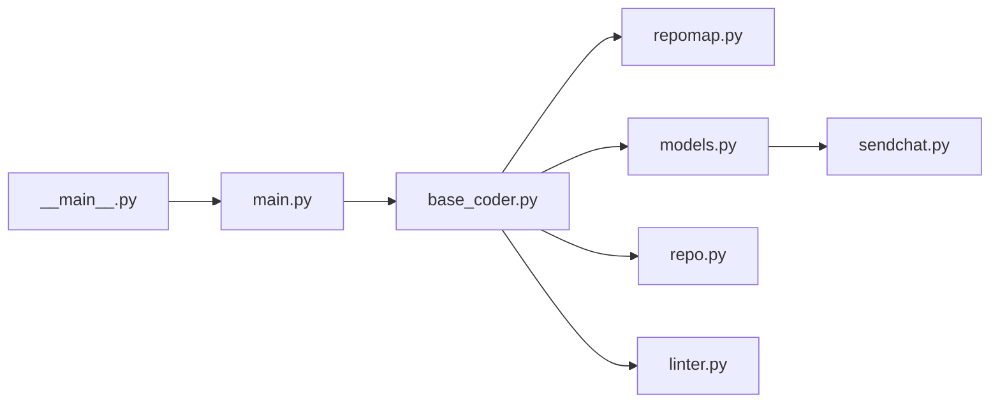

# Aider-AI/aider

> Assistant de programmation en terminal qui édite ton dépôt git via un LLM, pour développeurs.

## Le problème
Copier-coller du code entre un chat LLM et son éditeur perd le contexte du projet et l'historique git.

## Ce que ça fait vraiment
Construit une carte du dépôt (`repomap.py`, Tree-sitter) pour donner du contexte au modèle.
Plusieurs protocoles d'édition (bloc, diff unifié, architecte/éditeur) dans `aider/coders/`.
Applique les modifications, commit automatiquement, lance lint et tests et réinjecte les erreurs.
Modèles cloud ou locaux ; entrées images, URL, voix ; mode watch pour l'IDE.

## Comment c'est branché


## Essayer
```bash
python -m pip install aider-install
aider-install
cd /to/your/project
aider --model sonnet --api-key anthropic=<key>
```

## Coût et pièges
Facture du fournisseur LLM à ta charge. Un module `analytics.py` existe (télémétrie, isolée du cœur).

## Ce que ce n'est pas
Pas un agent autonome multi-tâches ; les modèles cités dans le README (Claude 3.7, o3-mini) datent.

## Alternatives
Non documenté.

## Pour toi
Solide pour l'édition assistée en terminal, mais comparer aux agents CLI actuels avant de l'adopter.
