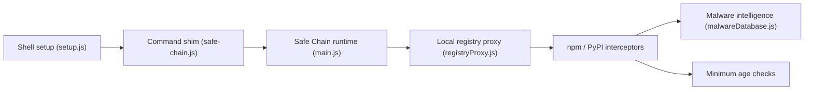

# AikidoSec/safe-chain

> Proxy local qui bloque les paquets npm et PyPI malveillants ou trop récents sur postes et CI.

## Le problème
Un `npm install` ou `pip install` peut tirer un paquet piégé ou fraîchement publié avant qu'il soit détecté.

## Ce que ça fait vraiment
Installe des alias (ou shims en CI) autour de npm, yarn, pnpm, bun, pip, uv, poetry, pipx, pdm. Chaque téléchargement passe par un proxy local qui vérifie la liste de menaces Aikido Intel et applique un âge minimal des paquets (48 h par défaut). Configurable par flag, variable d'environnement ou fichier ; miroir de la liste possible.

## Comment c'est branché


## Essayer
```bash
curl -fsSL https://github.com/AikidoSec/safe-chain/releases/download/1.5.20/install-safe-chain.sh -o /tmp/install-safe-chain.sh
sh /tmp/install-safe-chain.sh
npm safe-chain-verify
npm install safe-chain-test
```

## Coût et périphérie
Gratuit, sans jeton ; il faut redémarrer le terminal. Le proxy fait du MITM local : `PIP_CONFIG_FILE` doit être défini pour conserver ta config pip.

## Ce que ce n'est pas
Pas une garantie totale : il dépend de la liste de menaces Aikido (service externe) ; la protection élargie (Maven, Go, extensions…) relève du produit payant Device Protection.

## Alternatives
- Aikido Device Protection : version élargie et centralisée du même éditeur.

## Pour toi
À adopter : protection peu coûteuse de la chaîne d'approvisionnement Python/npm sur poste et CI, à valider après vérification de la licence.
