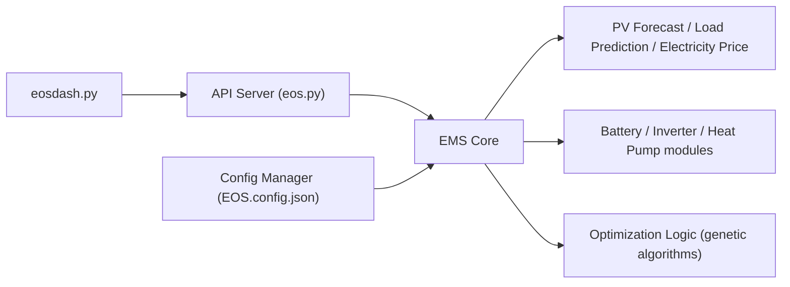

# Akkudoktor-EOS/EOS

> Moteur de simulation et d'optimisation énergétique domestique (PV, batterie, VE) à brancher sur une domotique.

## Le problème
Minimiser la consommation réseau et maximiser la revente exige de planifier batterie, véhicule et charges selon prévisions et prix.

## Ce que ça fait vraiment
Serveur FastAPI (API sur 8503, tableau de bord EOSdash sur 8504) qui prévoit production PV, charge et prix d'électricité, puis optimise par algorithme génétique un plan pour batterie, onduleur, VE et charges. Configuration par `EOS.config.json`. Ne pilote aucun équipement : il faut l'intégrer à Home Assistant, Node-RED ou EVCC.

## Comment c'est branché


## Essayer
```bash
docker pull akkudoktor/eos:latest
docker compose up -d
git clone https://github.com/Akkudoktor-EOS/EOS.git
python -m venv .venv
.venv/bin/pip install -r requirements.txt
.venv/bin/python -m akkudoktoreos.server.eos
```

## Coût et pièges
Gratuit ; Docker ou Python 3.11+. La prochaine version (non publiée) change l'API : `POST /v1/optimize` a un autre format, les appareils ont des IDs stables et des prévisions incomplètes peuvent arrêter un run.

## Ce que ce n'est pas
Ce n'est pas un contrôleur : sans domotique et sans configuration, il ne fait rien de concret. Licence à vérifier (non identifiée par GitHub).

## Alternatives
Aucune alternative nommée dans le README.

## Pour toi
À surveiller : cas d'optimisation et de prévision bien délimité, utile seulement si tu as une installation PV/batterie et une domotique.
