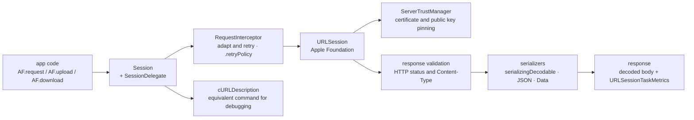

# Alamofire/Alamofire

> **An HTTP networking library in Swift for Apple-platform app developers, layered on `URLSession`.**

## The problem

Writing a network call with bare `URLSession` means hand-assembling URL building, parameter
encoding, headers, authentication, status-code and `Content-Type` validation, body decoding
and retry logic. Every project rewrites that layer, and every rewrite has its own gaps: no
automatic retry, no readable trace of what actually went over the wire.

## What it actually does

Alamofire wraps `URLSession` — the README says so plainly, it is the Apple foundation
underneath — behind a chain of calls: `AF.request(...)`, then `.authenticate`,
`.cacheResponse`, `.redirect`, `.validate`, `.serializingDecodable`, `.response`.

The README lists what the library itself provides: URL and JSON parameter encoding, upload of
file / data / stream / `MultipartFormData`, download to a file with resume data,
`URLCredential` authentication, response validation, progress closures, dynamic request
adaptation and retry (`RequestInterceptor`), TLS certificate and public key pinning, network
reachability.

Two debugging aids are highlighted: emitting the equivalent cURL command for a request
(`.cURLDescription`) and a `debugPrint` of the full response with metrics. Swift Concurrency
is supported back to iOS 13 / macOS 10.15, and Combine as well.

What it does not do itself is delegated to sibling libraries from the same foundation:
AlamofireImage (image serializers and cache) and AlamofireNetworkActivityIndicator.

## How it is wired

No code-derived diagram exists for this repository: the graph below is reconstructed from the
README alone, using the types it names.



## Trying it

The README gives no start-up command, only dependency declarations. In a `Package.swift`
(Swift Package Manager):

```swift
dependencies: [
    .package(url: "https://github.com/Alamofire/Alamofire.git", from: "5.12.0")
]
```

With CocoaPods, in the `Podfile`: `pod 'Alamofire'`. With Carthage, in the `Cartfile`:
`github "Alamofire/Alamofire"`. The only documented command-line path is manual integration
as a git submodule:

```bash
$ git init
$ git submodule add https://github.com/Alamofire/Alamofire.git
```

After that the README says to drag `Alamofire.xcodeproj` into the Xcode project navigator and
add the right `Alamofire.framework` under "Embedded Binaries".

## Cost and gotchas

- **Free, MIT licensed**, no API key, no quota, no account to create. The cost lies in the
  platform instead.
- **Xcode and Swift 6.0 minimum** (Xcode 16.0) for iOS 10+ / macOS 10.12+ / tvOS 10+ /
  watchOS 3+. On Linux, Windows and Android the README requires "Latest Only" plus Swift
  Package Manager.
- **Linux, Windows and Android are "Building But Unsupported"** — the main trap. The README
  lists what is missing or broken: no `ServerTrustManager`, hence **no certificate pinning and
  no client certificates**; HTTP Basic and Digest authentication "may crash"; no cache control
  via `CachedResponseHandler`; `URLSessionTaskMetrics` never gathered; no `WebSocketRequest`.
  The cause is `swift-corelibs-foundation`, not Alamofire.
- **Dynamic linking**: the README explicitly advises against the `AlamofireDynamic` target
  unless you are sure you need it.
- **Third-party distribution chain**: integration goes through CocoaPods, Carthage, SPM or a
  submodule pointing at GitHub — the project's only external dependency.
- **Three open Apple radars** are flagged, including background URL session configurations not
  working in the simulator.

## What it is not

- **Not a replacement for `URLSession`**, a layer on top of it: whatever `URLSession` lacks on
  a platform, Alamofire lacks too, as the Linux and Windows feature list shows.
- **Not portable** despite the platform badges: it compiles where it is not supported for use,
  and the README asks that crashes be reported to the Swift bug tracker, not to Alamofire.
- **Not an image or model library**: image decoding, image caching and the network activity
  indicator live in separate repositories you install on top.

## Alternatives

| | When to pick it |
|---|---|
| **Alamofire/AlamofireImage** | Named in the README: a companion, not a competitor. Add it as soon as you download and display images, which Alamofire alone does not do. |
| **SwiftyJSON/SwiftyJSON** | A catalogue neighbour on the next link of the chain: loose JSON reading without a `Decodable` type. Prefer it when responses are irregular or unknown; Alamofire already covers typed decoding via `serializingDecodable`. |
| **SwifterSwift/SwifterSwift** | A catalogue neighbour, unrelated to networking: a grab-bag of general Swift extensions. Not an alternative to an HTTP layer. |

The remaining neighbours (`jonkykong/SideMenu`, `HeroTransitions/Hero`) are UI libraries: no
comparable alternative in the catalogue on that side.

## For you

Watch rather than adopt: for a data / AI / MLOps profile, Alamofire only matters if you write
an Apple client app talking to your own inference APIs — otherwise none of this applies. In
that case it is the ecosystem default, and the automatic retry plus cURL output save real time
when debugging a remote service. For server-side Swift on Linux, walk away: the README
declares the platform unsupported.
