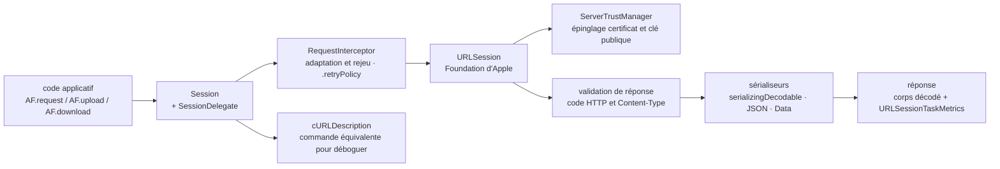

# Alamofire/Alamofire

> **Bibliothèque HTTP en Swift pour développeurs d'applications Apple, posée au-dessus de `URLSession`.**

## Le problème

Écrire une requête réseau avec `URLSession` seul demande d'assembler à la main la
construction de l'URL, l'encodage des paramètres, les en-têtes, l'authentification, la
validation du code de retour et du `Content-Type`, le décodage du corps et la reprise sur
erreur. Chaque projet réécrit la même couche, et chaque réécriture a ses propres trous :
pas de rejeu automatique, pas de trace lisible de ce qui est réellement parti sur le fil.

## Ce que ça fait vraiment

Alamofire enveloppe `URLSession` — le README le dit explicitement, c'est le socle Apple
sous-jacent — derrière une chaîne d'appels : `AF.request(...)`, puis `.authenticate`,
`.cacheResponse`, `.redirect`, `.validate`, `.serializingDecodable`, `.response`.

Le README énumère ce que la bibliothèque fournit elle-même : encodage de paramètres URL et
JSON, envoi de fichier / données / flux / `MultipartFormData`, téléchargement vers un fichier
avec reprise par `resume data`, authentification par `URLCredential`, validation de réponse,
fermetures de progression, adaptation et rejeu dynamiques des requêtes (`RequestInterceptor`),
épinglage de certificat et de clé publique TLS, joignabilité réseau.

Deux facilités de mise au point sont mises en avant : la production d'une commande cURL
équivalente à la requête (`.cURLDescription`) et un `debugPrint` de la réponse complète avec
métriques. La concurrence Swift est prise en charge jusqu'à iOS 13 / macOS 10.15, et Combine
également.

Ce qu'elle ne fait pas elle-même est renvoyé à des bibliothèques satellites de la même
fondation : AlamofireImage (sérialiseurs et cache d'images) et
AlamofireNetworkActivityIndicator.

## Comment c'est branché

Aucun diagramme tiré du code n'existe pour ce dépôt : ce schéma est reconstruit depuis le
seul README, à partir des types qu'il nomme.



## Essayer

Le README ne donne pas de commande de démarrage : il donne des déclarations de dépendance.
Dans un `Package.swift` (Swift Package Manager) :

```swift
dependencies: [
    .package(url: "https://github.com/Alamofire/Alamofire.git", from: "5.12.0")
]
```

Avec CocoaPods, dans le `Podfile` : `pod 'Alamofire'`. Avec Carthage, dans le `Cartfile` :
`github "Alamofire/Alamofire"`. La seule voie ligne de commande documentée est l'intégration
manuelle par sous-module git :

```bash
$ git init
$ git submodule add https://github.com/Alamofire/Alamofire.git
```

Il faut ensuite, d'après le README, glisser `Alamofire.xcodeproj` dans le navigateur de projet
Xcode et ajouter le bon `Alamofire.framework` aux « Embedded Binaries ».

## Coût et pièges

- **Gratuit, licence MIT**, aucune clé d'API, aucun quota, aucun compte à créer. Le coût est
  ailleurs : dans la plateforme.
- **Xcode et Swift 6.0 minimum** (Xcode 16.0) pour iOS 10+ / macOS 10.12+ / tvOS 10+ /
  watchOS 3+. Sur Linux, Windows et Android, le README exige « Latest Only » et Swift Package
  Manager.
- **Linux, Windows et Android sont « Building But Unsupported »** — c'est le piège principal.
  Le README liste ce qui manque ou casse : pas de `ServerTrustManager`, donc **pas
  d'épinglage de certificat ni de certificat client** ; l'authentification HTTP Basic et Digest
  « peut planter » ; pas de contrôle de cache via `CachedResponseHandler` ; jamais de
  `URLSessionTaskMetrics` ; pas de `WebSocketRequest`. La cause est `swift-corelibs-foundation`,
  pas Alamofire.
- **Édition de liens dynamique** : le README déconseille explicitement la cible
  `AlamofireDynamic` sauf besoin avéré.
- **Chaîne de distribution tierce** : l'intégration passe par CocoaPods, Carthage, SPM ou un
  sous-module pointant sur GitHub — c'est le sens de l'alerte, la seule dépendance externe du
  projet.
- **Trois radars Apple ouverts** sont signalés, dont les configurations de session en arrière-plan
  qui ne fonctionnent pas dans le simulateur.

## Ce que ce n'est pas

- **Ce n'est pas un remplacement de `URLSession`**, c'est une couche par-dessus : tout ce qui
  manque à `URLSession` sur une plateforme manque aussi à Alamofire, comme le montre la liste
  des fonctions absentes sur Linux et Windows.
- **Ce n'est pas portable** malgré les badges de plateformes : la compilation réussit là où
  l'usage n'est pas supporté, et le README demande de rapporter les plantages au projet Swift,
  pas à Alamofire.
- **Ce n'est pas une bibliothèque de modèles ou d'images** : le décodage d'images, le cache
  d'images et l'indicateur d'activité réseau sont des dépôts séparés à installer en plus.

## Alternatives

| | Quand le préférer |
|---|---|
| **Alamofire/AlamofireImage** | Nommée dans le README : complément, pas concurrent. À ajouter dès qu'on télécharge et affiche des images, ce qu'Alamofire seul ne fait pas. |
| **SwiftyJSON/SwiftyJSON** | Voisin du catalogue, sur le maillon d'après : lecture souple de JSON sans type `Decodable`. À préférer quand la réponse est irrégulière ou inconnue ; Alamofire couvre déjà le décodage typé via `serializingDecodable`. |
| **SwifterSwift/SwifterSwift** | Voisin du catalogue, hors sujet réseau : boîte d'extensions Swift généralistes. Pas une alternative à une couche HTTP. |

Les autres voisins (`jonkykong/SideMenu`, `HeroTransitions/Hero`) sont des bibliothèques
d'interface : aucune alternative comparable dans le catalogue de ce côté.

## Pour toi

À surveiller plutôt qu'à adopter : pour un profil data / IA / MLOps, Alamofire n'entre en jeu
que si l'on écrit une application cliente Apple qui parle à ses propres API d'inférence — sinon
rien ici ne sert. Dans ce cas précis, c'est le choix par défaut de l'écosystème, avec le rejeu
automatique et la sortie cURL qui font gagner du temps au débogage d'un service distant.
Côté serveur Swift sur Linux, passer son chemin : le README déclare la plateforme non supportée.
