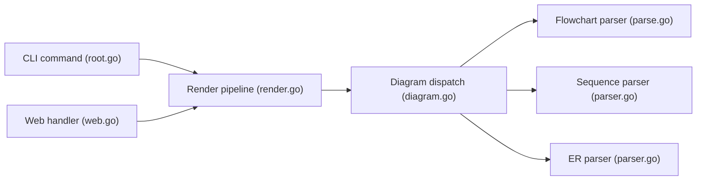

# AlexanderGrooff/mermaid-ascii

> Outil en ligne de commande qui dessine des diagrammes Mermaid en art ASCII ou Unicode dans le terminal.

## Le problème
Voir un diagramme Mermaid sans navigateur ni moteur de rendu, par exemple dans un terminal ou un README texte.

## Ce que ça fait vraiment
- Rend flowcharts (`graph LR`/`TD`), diagrammes de séquence et diagrammes entité-relation.
- Options d'espacement, `--max-width`, mode ASCII pur, couleurs via `classDef`.
- Lit un fichier ou l'entrée standard ; interface web optionnelle (`web`).
- Limites listées : pas de formes autres que rectangles, pas de flèches diagonales, pas d'autres types de diagrammes.

## Comment c'est branché


## Essayer
```bash
go build
mermaid-ascii --file test.mermaid
cat test.mermaid | mermaid-ascii --ascii
docker run -p 3001:3001 mermaid-ascii web --port 3001
```

## Coût et pièges
Gratuit, binaire Go unique. Les diagrammes très denses peuvent dépasser la largeur du terminal.

## Ce que ce n'est pas
Pas un remplaçant de Mermaid : sous-ensemble de la syntaxe.

## Alternatives
Aucune alternative nommée dans le README.

## Pour toi
À adopter : outil minuscule et sans dépendance, pratique pour afficher dans un terminal ou un log les diagrammes que génèrent tes scripts ou agents.

