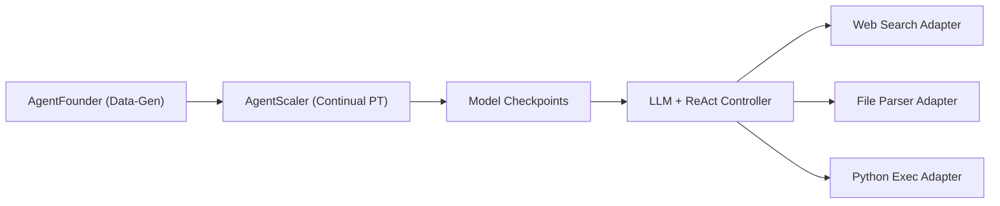

# Alibaba-NLP/DeepResearch

> Modèle agentique Tongyi DeepResearch 30B-A3B et scripts d'inférence pour la recherche web longue.

## Le problème
Les tâches de recherche d'information sur de nombreuses étapes épuisent le contexte et le raisonnement des LLM généralistes.

## Ce que ça fait vraiment
Publie un modèle MoE de 30,5 B paramètres (3,3 B actifs), contexte 128K, entraîné par pré-entraînement continu sur données agentiques et RL on-policy.
Deux modes d'inférence : ReAct, et « Heavy » basé IterResearch pour étendre le calcul au moment du test.
Le script `run_react_infer.sh` fait tourner le modèle sur un jeu de questions JSON/JSONL avec outils : recherche Serper, lecture Jina, parsing de fichiers, sandbox Python.
Rassemble aussi une famille de prototypes WebAgent et des scripts d'évaluation.

## Comment c'est branché


## Essayer
```bash
conda create -n react_infer_env python=3.10.0
conda activate react_infer_env
pip install -r requirements.txt
cp .env.example .env
bash run_react_infer.sh
```

## Coût et pièges
Cinq services externes à configurer (Serper, Jina, API OpenAI-compatible, Dashscope, SandboxFusion). Poids locaux sur GPU, ou via OpenRouter sans GPU.

## Ce que ce n'est pas
Pas une application prête à l'emploi : c'est un kit de recherche orienté benchmark. La démo en ligne est instable, précise le README.

## Alternatives
Aucune alternative nommée ; le README liste ses propres travaux (WebDancer, WebSailor…).

## Pour toi
À surveiller : modèle ouvert intéressant pour la « deep research », mais la dépendance à plusieurs API payantes rend l'expérimentation plus coûteuse qu'elle ne paraît.
