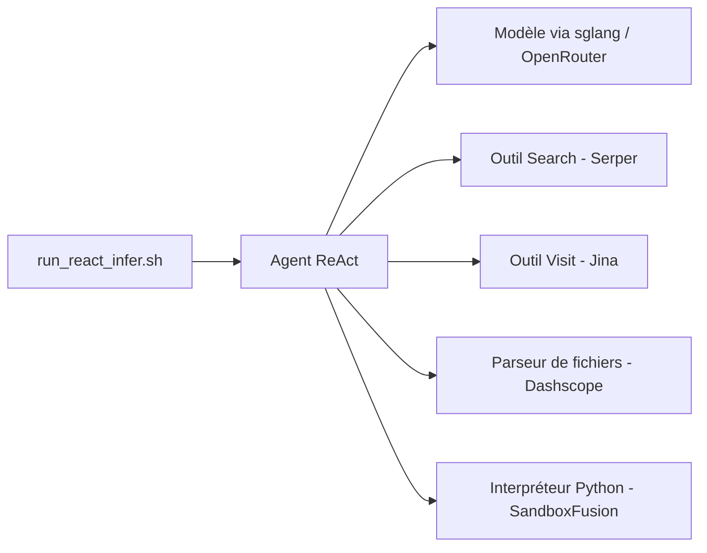

# Alibaba-NLP/WebAgent

> Code et modèle Tongyi DeepResearch (30B, 3B actifs) pour la recherche d'information longue sur le web.

## Le problème
Les modèles de langage généralistes peinent sur les questions qui demandent de longues chaînes de recherche web.

## Ce que ça fait vraiment
Le dépôt héberge Tongyi DeepResearch, un modèle agentique de 30,5 milliards de paramètres (3,3 milliards actifs, contexte 128K), et les scripts d'inférence ReAct ou mode « Heavy ». Le README revendique des résultats de pointe sur des benchmarks de recherche ; à prendre comme déclaration de l'auteur. Le code contient aussi WebDancer (démo Gradio, entraînement) et WebWalker (benchmark avec RAG). Une longue liste d'articles de la famille est fournie.

## Comment c'est branché


## Essayer
```bash
conda create -n react_infer_env python=3.10.0
conda activate react_infer_env
pip install -r requirements.txt
cp .env.example .env
bash run_react_infer.sh
```

## Coût et pièges
Plusieurs clés (Serper, Jina, Dashscope, API de résumé) et un sandbox Python. Sans GPU, le modèle est utilisable via OpenRouter en modifiant `react_agent.py`. Python 3.10.0 recommandé.

## Ce que ce n'est pas
Pas un service prêt à l'emploi : la démo en ligne est indiquée comme instable. Dernier push le 2026-02-27, activité ralentie.

## Alternatives
Aucune alternative externe nommée ; les articles cités (WebWalker, WebDancer, WebSailor…) sont des variantes de la même famille.

## Pour toi
À surveiller : référence utile pour comprendre un agent de recherche entraîné, mais la mise en route exige beaucoup de services tiers.
