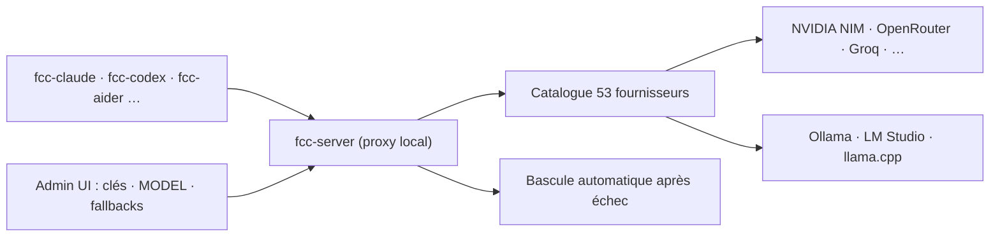

# Alishahryar1/free-claude-code

> Proxy local qui branche dix agents de code sur 53 fournisseurs de modèles.

## Le problème
Chaque agent de code est lié à son fournisseur ; changer de modèle ou survivre à une panne suppose de reconfigurer, voire de recommencer le tour en cours.

## Ce que ça fait vraiment
Un serveur local (`fcc-server`) avec une UI d'administration, et des lanceurs par agent : `fcc-claude`, `fcc-codex`, `fcc-pi`, `fcc-opencode`, `fcc-cline`, `fcc-hermes`, `fcc-dsh`, `fcc-grok`, `fcc-muse`, `fcc-aider`. Un catalogue de modèles unique couvre NVIDIA NIM, OpenRouter, Groq, xAI, Gemini, Vertex, Bedrock, Cerebras, Mistral, Z.ai, ainsi que LM Studio, llama.cpp et Ollama en local. Bascule automatique vers le modèle suivant après épuisement des retries. Routage par palier (`MODEL_OPUS`, `MODEL_SONNET`, `MODEL_HAIKU`), contrôle du niveau de raisonnement, intégrations VS Code / JetBrains / Discord / Telegram et notes vocales (Whisper local ou NVIDIA NIM).

## Comment c'est branché


## Essayer
```bash
curl -fsSL "https://raw.githubusercontent.com/Alishahryar1/free-claude-code/main/scripts/install.sh" | sh
fcc-server
fcc-claude
```

## Coût et pièges
Les quotas gratuits sont fixés par chaque fournisseur et peuvent changer. Une requête en échec peut consommer du quota chez **plusieurs** fournisseurs avant d'aboutir. Le proxy local peut être protégé par un jeton bearer (option à activer). L'installation se fait par un script distant à relire avant exécution.

## Ce que ce n'est pas
Projet indépendant, non affilié à Anthropic, qui précise suivre les conditions d'utilisation des fournisseurs et retirer les intégrations qui cesseraient d'être autorisées. Les abonnements ChatGPT et Copilot passent par ton compte, pas par une clé : les politiques d'organisation s'appliquent. L'intégration RTK est temporairement indisponible pour OpenCode 2.

## Alternatives
Aucune alternative nommée dans le README.

## Pour toi
À surveiller : pratique pour comparer des modèles à iso-agent, mais vérifie les CGU de chaque fournisseur avant tout usage professionnel.
