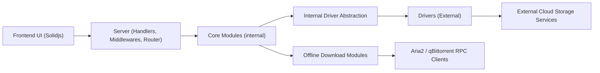

# AlistGo/alist

> Explorateur de fichiers web en Go qui unifie de nombreux stockages cloud et distants derrière une seule interface.

## Le problème
Les fichiers sont éparpillés sur plusieurs disques cloud, chacun avec sa propre interface et ses limites.

## Ce que ça fait vraiment
Un serveur Go (Gin) avec une interface Solidjs. Chaque stockage (local, S3, OneDrive, Google Drive, FTP/SFTP, WebDAV, SMB, Azure Blob, Aliyundrive, etc.) est un driver derrière une abstraction commune. Il prévisualise fichiers, images, vidéos, documents, gère téléversement, copie entre stockages, protection des routes et téléchargement hors ligne (aria2, qBittorrent).

## Comment c'est branché

Le texte d'architecture est un guide de dessin, plusieurs éléments y sont supposés.

## Essayer
Aucune commande documentée dans le README (renvoi vers le guide en ligne alistgo.com/guide).

## Coût et pièges
Gratuit, mais chaque stockage exige un compte chez le fournisseur. Le README avertit : risque de bannissement de compte ou de limitation de débit, à tes risques.

## Ce que ce n'est pas
Ce n'est pas un stockage : il ne fait que rediriger (302) ou relayer le trafic vers les fournisseurs. Licence AGPL-3.0.

## Alternatives
Aucune alternative nommée dans le README.

## Pour toi
À ignorer : surtout orienté disques cloud grand public, et l'AGPL complique toute intégration ; pour du S3 ou du SFTP, les outils natifs suffisent.

