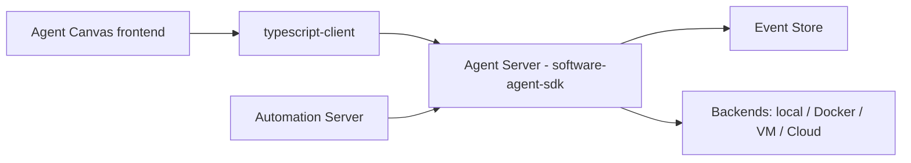

# All-Hands-AI/OpenHands

> Poste de pilotage auto-hébergé pour lancer et automatiser des agents de code (OpenHands, Claude Code, Codex, Gemini), pour développeurs.

## Le problème
Les agents de code tournent chacun dans leur coin (terminal, VM, cloud) et se pilotent mal. Automatiser des tâches récurrentes (rapports Slack, découpage d'issues GitHub) demande du bricolage.

## Ce que ça fait vraiment
Le README décrit « Agent Canvas » : une interface qui démarre des conversations avec des agents et se connecte à plusieurs « Agent Servers » (local, Docker, VM, OpenHands Cloud). Un serveur d'automatisation déclenche des agents sur planning ou sur webhook (Slack, GitHub, Linear). L'agent OpenHands est fourni ; tout agent compatible ACP peut être branché. D'après le code, le cœur Python repose sur un système d'événements (actions/observations) sérialisés.

## Comment c'est branché


## Essayer
```bash
npm install -g @openhands/agent-canvas
agent-canvas
```
```bash
docker run -it --rm \
  -p 8000:8000 \
  -v "$HOME/.openhands:/home/openhands/.openhands" \
  -v "${PROJECTS_PATH}:/projects" \
  ghcr.io/openhands/agent-canvas:1.20.0
```

## Coût et pièges
Modèle au choix : clé d'API du fournisseur à ta charge. Sans sandbox, l'agent a accès complet à ton système de fichiers (avertissement du README). Node 22.12+ et `uv` requis.

## Ce que ce n'est pas
Pas un agent unique : c'est un tableau de bord qui orchestre des agents. Le dépôt est réparti en plusieurs repos (SDK, client TypeScript, automation) ; certains comportements ne sont pas ici. Le durcissement de sécurité pour un serveur exposé est renvoyé à SELF_HOSTING.md, non lu.

## Alternatives
Aucune alternative nommée dans le README ; Claude Code, Codex et Gemini y sont des agents que l'outil pilote, pas des concurrents.

## Pour toi
À surveiller : utile si tu veux orchestrer plusieurs agents de code sur des tâches récurrentes, mais il faut accepter une pile multi-dépôts et un vrai travail de sandboxing.
