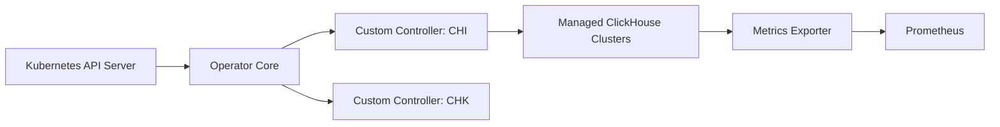

# Altinity/clickhouse-operator

> Opérateur Kubernetes pour créer, configurer et faire évoluer des clusters ClickHouse.

## Le problème
Déployer ClickHouse répliqué sur Kubernetes : volumes, configuration, utilisateurs, mises à jour et propagation de schéma sont fastidieux à la main.

## Ce que ça fait vraiment
Des ressources personnalisées décrivent le cluster ; les contrôleurs `chi` (installations ClickHouse) et `chk` (Keeper) réconcilient l'état. Gère modèles de volumes, de pods et de services, configuration et utilisateurs, mise à l'échelle avec propagation automatique du schéma, montées de version, export Prometheus. Images compatibles FIPS 140-3.

## Comment c'est branché

## Essayer
Aucune commande dans le README ; il renvoie à un Quick Start Guide et à l'installation détaillée.

## Coût et pièges
Prérequis : Kubernetes 1.25+, ClickHouse 21.11+ (versions plus anciennes : opérateur 0.23.7 ou moins). Stockage persistant et ZooKeeper/Keeper selon la réplication.

## Ce que ce n'est pas
Ce n'est pas ClickHouse ni un service géré : uniquement l'automatisation Kubernetes.

## Alternatives
Aucune alternative nommée dans le README.

## Pour toi
À surveiller : pertinent si ClickHouse porte tes analyses ou features sur Kubernetes ; la maturité et l'activité (push récent) rassurent.
