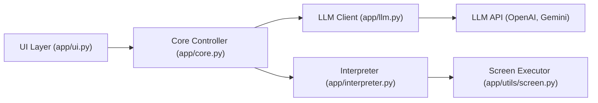

# AmberSahdev/Open-Interface

> Application de bureau qui pilote clavier et souris de ton ordinateur via un LLM à partir de captures d'écran.

## Le problème
Automatiser des tâches graphiques sans API ni script, en décrivant simplement l'objectif.

## Ce que ça fait vraiment
Boucle : capture d'écran plus objectif envoyés au LLM, instructions renvoyées, exécution par simulation clavier/souris, nouvelle capture. Modèles GPT-4o, Gemini ou tout backend compatible OpenAI. Binaires macOS, Linux (testé Ubuntu 20.04) et Windows 10, ou script Python 3.12+.

## Comment c'est branché


## Essayer
```bash
git clone https://github.com/AmberSahdev/Open-Interface.git
cd Open-Interface
python -m venv .venv
source .venv/bin/activate
pip install -r requirements.txt
python app/app.py
```

## Coût et pièges
Clé OpenAI requise (5 $ minimum pour GPT-4o) ; 0,0005 à 0,002 $ par appel, de deux à plusieurs dizaines d'appels par demande. Permissions d'accessibilité et d'enregistrement d'écran sur Mac. Ne voit que l'écran principal.

## Ce que ce n'est pas
Pas fiable sur le raisonnement spatial, les tableurs ou les applications riches en curseur (le README le dit). Il agit réellement sur ta machine.

## Alternatives
Aucune alternative nommée dans le README.

## Pour toi
À surveiller : démonstration intéressante de contrôle d'ordinateur par LLM, mais laisser un modèle agir sur ta machine est risqué ; l'essayer dans une VM.
