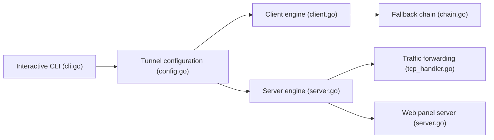

# AminMGMT/BackPack

> Moteur de tunnel en Go entre serveurs iraniens et étrangers, avec CLI, panneau web et repli de transport.

## Le problème
Les routes réseau vers l'Iran sont filtrées ou instables et un seul protocole ne tient pas.

## Ce que ça fait vraiment
Tunnel inverse (le serveur étranger appelle le serveur iranien) ou tunnel IP complet GRE chiffré Noise. Douze transports (TCP, Stealth, PCK, KCP+FEC, QUIC, WS/WSS, ICMP), bascule automatique, test de lien, surveillance par Telegram, panneau web sur le port 7777, sauvegardes, mises à jour vérifiées avec retour arrière.

## Comment c'est branché


## Essayer
```bash
bash <(curl -fsSL https://raw.githubusercontent.com/AminMGMT/BackPack/main/install.sh)
sudo backpack
```

## Coût et pièges
Deux serveurs nécessaires, root pour certains transports. Licence AGPL-3.0 ; le nom et le logo ne sont pas sous licence ; mention d'attribution obligatoire pour les forks.

## Ce que ce n'est pas
Pas un outil de confidentialité garanti : les transports simples ne chiffrent pas le jeton. Projet de juillet 2026, jeune.

## Alternatives
Aucune alternative nommée dans le README.

## Pour toi
À ignorer : outil de contournement réseau sans lien avec data, IA ou MLOps, et jeune.

