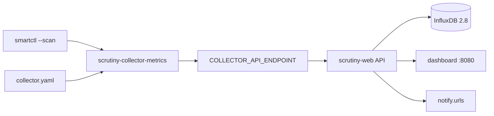

# AnalogJ/scrutiny

> Tableau de bord web pour les métriques S.M.A.R.T des disques, avec historique et alertes.

## Le problème
`smartd` ne distingue pas les attributs critiques des informatifs, ne garde pas d'historique, et ses seuils constructeur ne se déclenchent souvent qu'une fois le disque mort.

## Ce que ça fait vraiment
Détecte automatiquement les disques via `smartctl --scan` et affiche un tableau de bord centré sur les métriques critiques.
Enregistre l'historique des attributs S.M.A.R.T pour repérer une dégradation lente, et suit la température.
Applique des seuils personnalisés issus de taux de panne réels, au lieu des seuils constructeur.
Notifications configurables : script custom, email, webhooks, Discord, Gotify, ntfy, Slack, Teams, Telegram et une dizaine d'autres.

## Comment c'est branché


## Essayer
```bash
docker run -p 8080:8080 -p 8086:8086 --restart unless-stopped \
  -v `pwd`/scrutiny:/opt/scrutiny/config \
  -v /run/udev:/run/udev:ro \
  --cap-add SYS_RAWIO \
  --device=/dev/sda \
  ghcr.io/analogj/scrutiny:latest-omnibus
docker exec scrutiny /opt/scrutiny/bin/scrutiny-collector-metrics run
```

## Coût et pièges
Gratuit. Le conteneur exige `--cap-add SYS_RAWIO`, `/run/udev` en lecture, et un `--device` par disque — plus `SYS_ADMIN` pour les NVMe. Le README déconseille les tags `latest-` et recommande d'épingler une version. Le collecteur tourne une fois par jour par défaut.

## Ce que ce n'est pas
Pas fini : le README annonce d'emblée un travail en cours, avec des aspérités. Pas un remplaçant de `smartd` : il s'appuie dessus. Certains contrôleurs RAID ne laissent pas passer les données SMART, et `--scan` peut mal détecter le type de device — à corriger dans la config.

## Alternatives
`smartd` seul — décrit comme la base sur laquelle Scrutiny s'appuie, pas comme un concurrent.

## Pour toi
À installer sur une machine de travail à plusieurs disques : détecter un disque mourant avant de perdre un dataset vaut les vingt minutes de mise en place.
