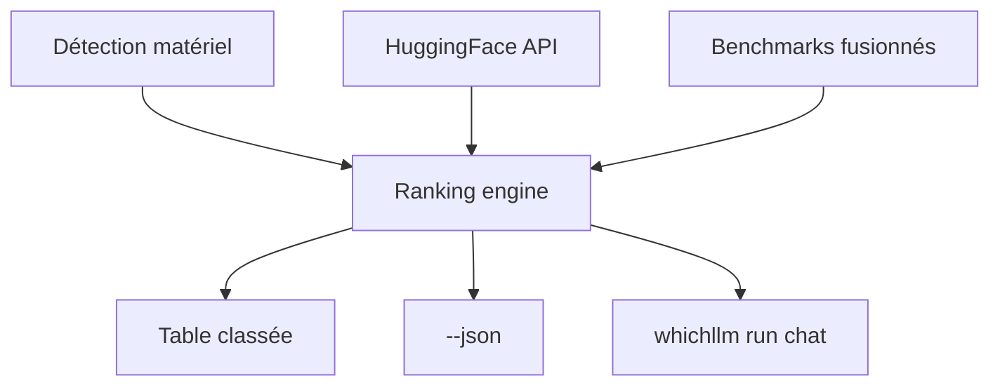

# Andyyyy64/whichllm

> CLI qui détecte ton matériel et classe les meilleurs LLM locaux qui y tournent.

## Le problème
Savoir quel modèle *rentre* dans sa VRAM est facile ; savoir lequel des modèles qui rentrent est réellement le meilleur ne l'est pas. Les outils « what fits » donnent le plus gros, pas le meilleur.

## Ce que ça fait vraiment
Détecte GPU/CPU/RAM (NVIDIA, AMD, Intel, Apple), classe les modèles HuggingFace par fit VRAM, vitesse et qualité de benchmark. Classement fondé sur benchmarks réels fusionnés (LiveBench, Artificial Analysis, Aider, Arena ELO), pas une heuristique de taille. Simule un GPU (`--gpu "RTX 4090"`), planifie un achat, lance un chat (`whichllm run`), imprime un snippet Python, sort du JSON. Estimation VRAM = poids + KV cache + activation + overhead ; vitesse bandwidth-bound.

## Comment c'est branché


## Essayer
```bash
uvx whichllm@latest
```
```bash
uvx whichllm@latest --gpu-only --speed usable --vram-headroom 1GB
```

## Coût et pièges
Gratuit, aucune clé. Python 3.11+. Données live depuis HuggingFace (cache 6h/24h) avec fallback offline. Les vitesses sont des plages de planification, pas des benchmarks live. Mainteneur unique.

## Ce que ce n'est pas
Pas un moteur d'inférence : il recommande et peut lancer un chat via llama.cpp/transformers, mais ne sert pas. Mapping HF→Ollama à faire soi-même.

## Alternatives
- LM Studio : comparé comme référence de recommandation « confortable ».
- Ollama : intégration proposée, pas un substitut de classement.

## Pour toi
Excellent pour un data scientist qui choisit un LLM local selon sa machine ; scriptable en JSON — à adopter.
