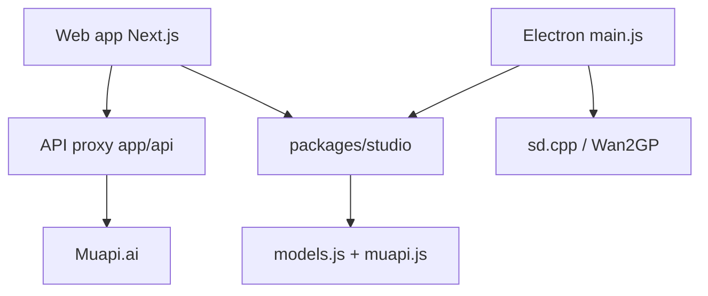

# Anil-matcha/Open-Generative-AI

> Studio de génération d'images, vidéos et lip sync, branché sur l'API Muapi ou sur des moteurs locaux.

## Le problème
Utiliser plusieurs modèles de génération d'images et de vidéo depuis une seule interface, sans abonnement à chaque plateforme.

## Ce que ça fait vraiment
Interface web (Next.js) et application de bureau (Electron) offrant des studios : image, vidéo, audio, lip sync, cinéma, workflows, agents. La plupart des modèles passent par l'API Muapi.ai, avec une clé stockée dans le navigateur. Deux moteurs locaux existent sur l'app de bureau : sd.cpp (image, intégré) et Wan2GP (serveur à toi, GPU CUDA/ROCm). L'historique et les images de référence sont conservés en local.

## Comment c'est branché


## Essayer
```bash
git clone --recurse-submodules https://github.com/Anil-matcha/Open-Generative-AI.git
cd Open-Generative-AI
npm run setup
npm run electron:dev   # application de bureau
npm run dev            # version web → http://localhost:3000
```

## Coût et pièges
Le code est gratuit, mais la génération via Muapi consomme une clé d'API à ta charge. Le README met aussi en avant une offre marque blanche payante (à partir de 49 $/mois). Installeurs non signés (avertissements macOS et Windows). Le README annonce l'absence de filtres de contenu : la responsabilité de l'usage et de la conformité légale (droits, droit à l'image, deepfakes) t'incombe.

## Ce que ce n'est pas
Ce n'est pas autonome : « open source » n'empêche pas la dépendance à un service tiers pour la plupart des modèles. L'inférence locale ne couvre que quelques modèles, et le studio vidéo local n'est pas encore câblé. Les données ne restent « locales » que sur ce chemin.

## Alternatives
- Wan2GP : serveur local pour les modèles vidéo, utilisé ici comme moteur distant.
- stable-diffusion.cpp : moteur d'inférence image sans passer par un service.

## Pour toi
À surveiller : utile pour tester plusieurs modèles génératifs, mais c'est surtout une vitrine d'un SaaS payant ; pour du local, mieux vaut Wan2GP directement.

