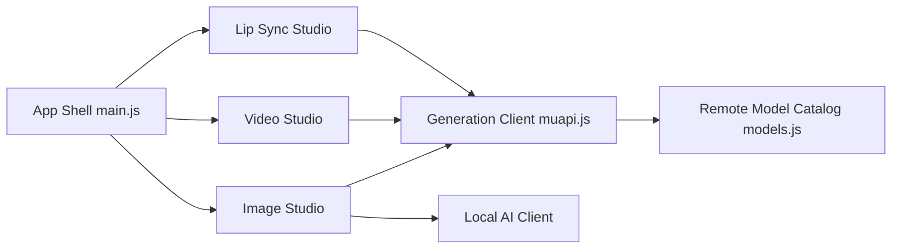

# Anil-matcha/Open-Higgsfield-AI

> Interface web et desktop pour générer images, vidéos et lip sync via l'API payante Muapi.ai.

## Le problème
Les plateformes de génération vidéo/image sont fermées, à abonnement et filtrent les prompts. Comparer plusieurs modèles demande autant de comptes.

## Ce que ça fait vraiment
- Regroupe des « studios » (image, vidéo, audio, lip sync, cinéma, workflows, agents) dans une seule interface Next.js/React.
- Envoie les générations à l'API Muapi.ai (soumission puis interrogation du résultat) avec une clé saisie dans le navigateur.
- Offre en option, dans l'app desktop Electron, de l'inférence locale : sd.cpp (images) ou un serveur Wan2GP à toi (vidéo, gros modèles d'image).
- Catalogue de 400+ modèles défini dans `models.js` ; l'historique reste en stockage local du navigateur.

## Comment c'est branché


## Essayer
```bash
git clone --recurse-submodules https://github.com/Anil-matcha/Open-Generative-AI.git
cd Open-Generative-AI
npm run setup
npm run electron:dev   # app desktop
npm run dev            # version web → http://localhost:3000
```

## Coût et pièges
Clé Muapi.ai obligatoire pour les modèles distants, facturée à l'usage ; le local demande 16 Go de RAM pour Z-Image et un GPU CUDA/ROCm côté serveur Wan2GP. Installeurs non signés (Gatekeeper, SmartScreen) et sous-modules git à cloner.

## Ce que ce n'est pas
Pas un moteur de génération autonome : l'essentiel passe par un SaaS tiers. Le « sans filtre » revendiqué ne dispense pas de respecter la loi ni les conditions des fournisseurs de modèles. Le README mélange aussi une offre commerciale de marque blanche (à partir de 49 $/mois).

## Alternatives
- Wan2GP : serveur local de génération vidéo/image que l'app sait déjà piloter, sans passer par un SaaS.
- stable-diffusion.cpp : moteur local d'images, déjà embarqué dans l'app.

## Pour toi
À surveiller : utile pour comparer des modèles génératifs derrière une seule UI, mais dépendant d'une API payante tierce et d'un mainteneur unique, donc pas une brique à industrialiser.

