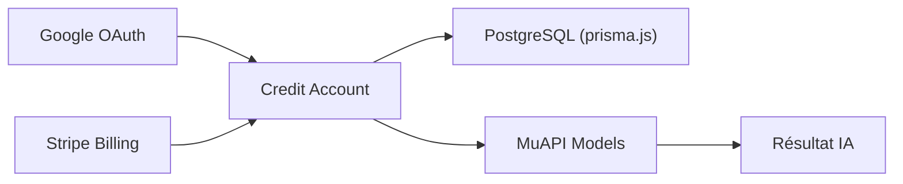

# Anil-matcha/awesome-generative-ai-apps

> Catalogue de modèles de SaaS d'IA générative à cloner, tous branchés sur l'API payante MuAPI.

## Le problème
Lancer un produit d'IA générative demande d'écrire auth, facturation et gestion de tâches asynchrones.

## Ce que ça fait vraiment
Liste des dizaines de gabarits (images, vidéo, écriture, agents, voix) dans des dépôts séparés, tous sur Next.js, Prisma, PostgreSQL, Google OAuth et Stripe, avec appels à MuAPI. Ce n'est pas une application unique. Le texte est promotionnel : chiffres de revenus et marges sans source.

## Comment c'est branché


## Essayer
```bash
git clone https://github.com/SamurAIGPT/<template-name>
cd <template-name>
cp .env.example .env
npx prisma db push && npm run dev
```

## Coût et pièges
Variables à fournir : DATABASE_URL, NEXTAUTH_SECRET, clés Google, Stripe, MUAPI_API_KEY. Chaque génération est facturée par MuAPI.

## Ce que ce n'est pas
Pas de revenus garantis, malgré le ton du README. Pas de code ici : l'essentiel est dans d'autres dépôts, non lus.

## Alternatives
Aucune citée hors des gabarits eux-mêmes (ai-saas-starter pour la base sans IA).

## Pour toi
Liste commerciale liée à un fournisseur d'API unique : ignorer.

