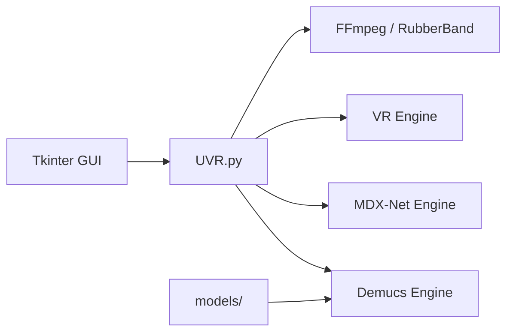

# Anjok07/ultimatevocalremovergui

> Application de bureau pour séparer voix et instruments dans des fichiers audio, en local.

## Le problème
Isoler une voix ou un instrument d'un morceau demande des modèles de séparation de sources et une chaîne audio difficile à monter.

## Ce que ça fait vraiment
Interface Tkinter qui pilote trois familles de moteurs : Demucs, MDX-Net et architecture VR.
Modèles entraînés par les développeurs (sauf Demucs v3/v4 4 stems), stockés dans `models/`.
FFmpeg pour les formats non-WAV, Rubber Band pour time-stretch et pitch.
Installeurs Windows et macOS ; installation manuelle Python sous Linux.

## Comment c'est branché


## Essayer
```bash
python3 -m venv venv
source venv/bin/activate
pip install -r requirements.txt
python UVR.py
```

## Coût et pièges
Gratuit ; GPU Nvidia 6 Go minimum, 8 Go conseillés. Sous Windows, installer sur C:\ obligatoirement. Dernier push mars 2025.

## Ce que ce n'est pas
Pas une bibliothèque ni une API : usage interactif par GUI. Support AMD limité.

## Alternatives
Aucune alternative nommée dans le README (Demucs cité comme origine d'un moteur).

## Pour toi
Ignorer : outil grand public de séparation audio, hors besoins data/MLOps et inactif depuis plus d'un an.
