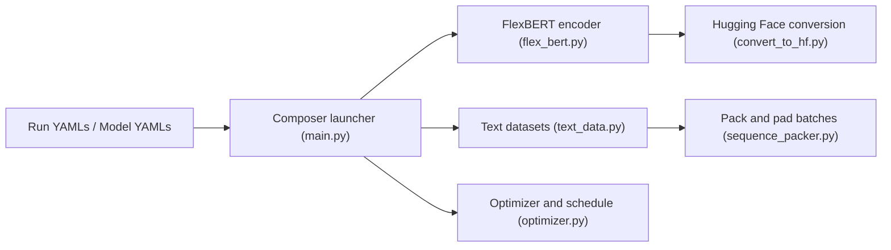

# AnswerDotAI/ModernBERT

> Dépôt de recherche pour préentraîner et évaluer les encodeurs ModernBERT et FlexBERT.

## Le problème
Les encodeurs de type BERT ont vieilli ; il faut reproduire leur modernisation (architecture, contexte long, échelle).

## Ce que ça fait vraiment
`main.py` lit un YAML et assemble modèle FlexBERT, chargeurs de données, optimiseur et trainer Composer. Fournit préparation de données MDS, packing de séquences, évaluations GLUE et SuperGLUE, exemples de retrieval (Sentence Transformers, ColBERT via PyLate), conversion vers Hugging Face et journalisation W&B. Le README se dit « très sommaire ».

## Comment c'est branché


## Essayer
```bash
conda env create -f environment.yaml
conda activate bert24
composer main.py yamls/main/modernbert-base.yaml
```

## Coût et pièges
GPU requis ; Flash Attention 2 (ou 3 sur H100) à compiler ou installer par roue. Le `NoStreamingDataset` exige des données MDS décompressées.

## Ce que ce n'est pas
Pas la version d'usage : pour utiliser le modèle dans un pipeline, le README renvoie à la collection Hugging Face. Points de contrôle intermédiaires : publication annoncée mais non faite.

## Alternatives
- MosaicBERT : base du code, dont ce dépôt étend un fork.
- Collection ModernBERT sur Hugging Face : pour l'usage courant.

## Pour toi
À surveiller : utile pour reproduire ou adapter un préentraînement d'encodeur ; pour l'inférence, utilise directement les modèles Hugging Face.
