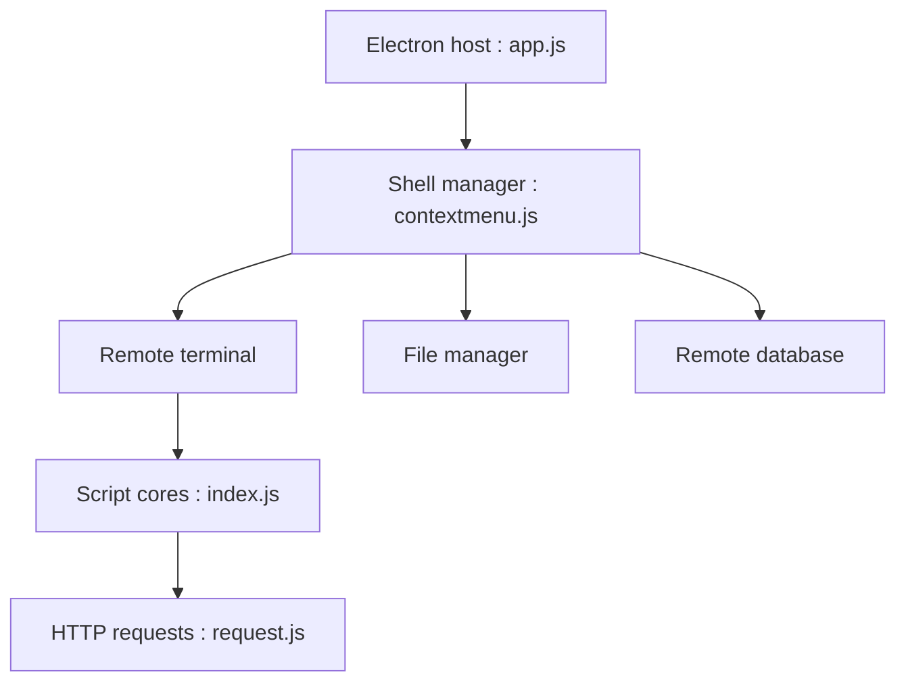

# AntSword/antSword

> Outil multi-plateforme d'administration de sites web par webshell, destiné aux pentesteurs autorisés et aux webmasters.

## Le problème
Piloter des webshells (terminal, fichiers, base de données) depuis une interface unique lors de tests d'intrusion autorisés.

## Ce que ça fait vraiment
Application Electron : on enregistre des shells cibles, puis on ouvre terminal distant, gestionnaire de fichiers, base de données ou vue du site. Des « cores » par famille de script, des encodeurs/décodeurs, un magasin de plugins et un service de mise à jour complètent l'ensemble.

## Comment c'est branché


## Essayer
```bash
# Aucune commande dans le README : renvoie vers la documentation « Quick Start » externe.
```

## Coût et pièges
Gratuit. Le README interdit l'usage illégal et la publication de versions modifiées non autorisées. Usage à réserver aux cibles pour lesquelles tu as une autorisation.

## Ce que ce n'est pas
Pas un outil de développement ou d'IA. C'est un outil de sécurité offensive : rien pour la donnée ou le MLOps.

## Alternatives
Aucune alternative nommée dans le README.

## Pour toi
À ignorer : hors de ton périmètre data/IA, et d'usage sensible nécessitant un cadre d'autorisation clair.

