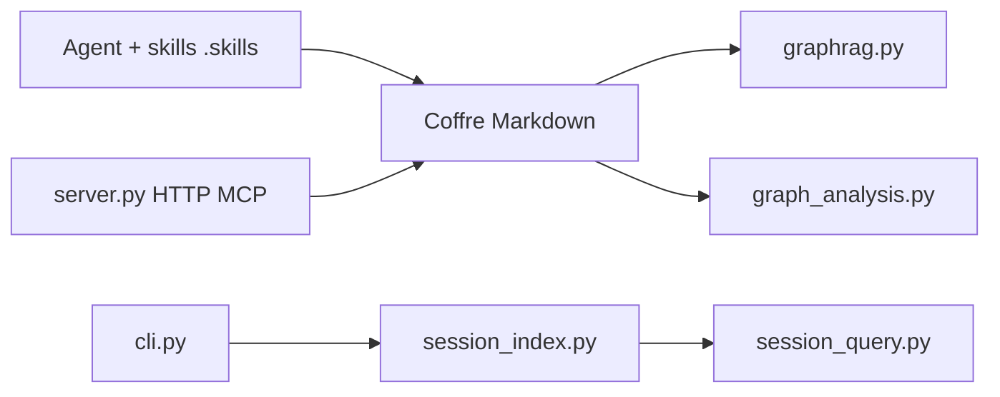

# Ar9av/obsidian-wiki

> Skills d'agent qui compilent tes notes et conversations en un coffre Obsidian interconnecté, sur le modèle du wiki LLM de Karpathy.

## Le problème
Ce qu'on apprend en résolvant un problème reste enfoui dans un historique de chat et se redécouvre de zéro trois mois plus tard.

## Ce que ça fait vraiment
39 skills en Markdown (`.skills/`), lus par Claude Code, Cursor, Codex et d'autres. Ils ingèrent des sources (`/wiki-ingest`, `/wiki-update`, `/wiki-capture`, `/wiki-history-ingest`), fusionnent dans des pages existantes, interrogent avec citations `[[lien]]` (`/wiki-query`), et nettoient (`/wiki-lint`, `/wiki-dedup`). Un CLI Python indexe les sessions d'agent et exporte le graphe (JSON, GraphML, Cypher). Chaque affirmation est étiquetée extraite, inférée ou ambiguë.

## Comment c'est branché


## Essayer
```bash
pip install obsidian-wiki
obsidian-wiki setup --vault ~/brain
obsidian-wiki sessions-build
obsidian-wiki sessions-query "the auth bug with the weird retry loop"
```

## Coût et pièges
Pas de clé d'API propre : c'est l'agent qui consomme tes jetons. Un manifeste ne relit que les sources modifiées. Projet d'avril 2026, très jeune.

## Ce que ce n'est pas
Pas une application autonome : tout passe par un agent, donc par ses coûts. L'étude de performance du README est minuscule (38 pages, deux essais par cellule) et l'auteur le reconnaît.

## Alternatives
Aucune alternative n'est nommée dans le README (le point de départ est le gist « LLM Wiki » de Karpathy).

## Pour toi
À adopter à titre d'essai : Markdown local sans verrou, MIT, réversible, utile pour capitaliser tes sessions d'agent.
