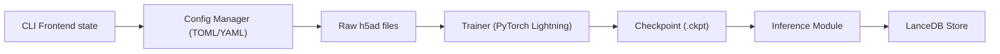

# ArcInstitute/state

> Modèles PyTorch pour prédire la réponse de cellules à des perturbations et produire des embeddings de cellules.

## Le problème
Prédire l'effet d'une perturbation génétique ou chimique sur des cellules de contextes variés est coûteux à tester en laboratoire.

## Ce que ça fait vraiment
Le CLI `state` a deux groupes : `state tx` (State Transition : `preprocess_train`, `train`, `predict`, `infer`) et `state emb` (State Embedding : `preprocess`, `fit`, `transform`, `query`). Il lit des fichiers h5ad, s'entraîne avec PyTorch Lightning et Hydra, et peut stocker les embeddings dans LanceDB pour la recherche de voisins. Suivi W&B et lancement Slurm côté code.

## Comment c'est branché


## Essayer
```bash
uv tool install arc-state
state tx preprocess_train --adata raw_data.h5ad --output preprocessed.h5ad --num_hvgs 2000
state tx predict --output-dir $HOME/state/test --checkpoint final.ckpt
state emb transform --model-folder /path/to/SE-600M --input in.h5ad --output out.h5ad
```

## Coût et pièges
GPU non chiffré dans le README, mais implicite (`--nv`, `num_gpus_per_node`). Données h5ad et checkpoints à fournir ; conteneur Singularity disponible. Licence non reconnue par GitHub.

## Ce que ce n'est pas
Pas un outil généraliste de single-cell : centré sur la prédiction de perturbations et l'embedding. Les performances relèvent du papier associé, non du README.

## Alternatives
Aucune alternative citée ; `cell-eval` (évaluation) et `cell-load` (chargement de données) sont des compagnons, pas des substituts.

## Pour toi
À surveiller si tu fais de l'IA pour la biologie : chaîne de bout en bout et Colabs, mais licence à lire et GPU nécessaire.
