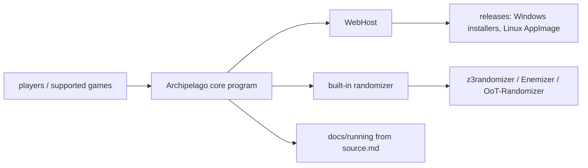

# ArchipelagoMW/Archipelago

> **A generic multiworld framework for game randomizers** — which, for now, is also the randomizer itself.

## The problem

Game randomizers exist one per game, each with its own logic and file formats. Linking several
players across several different games in a single shared run means rebuilding that machinery
every time, unless a common framework exists.

## What it actually does

The README states that Archipelago provides a generic framework for developing multiworld
capability for game randomizers, and adds that in all cases presently Archipelago is also the
randomizer itself. It lists roughly a hundred supported games, from *A Link to the Past* to
*Factorio*, *Stardew Valley*, *Starcraft 2*, *Civilization VI* and *Satisfactory*. The
repository also holds a WebHost and a core program, both named in the contributing guidelines.
The protocol, the generation step and how items are shuffled between worlds are not described
in the README, which points to the website's tutorials and FAQ instead.

## How it is wired

No diagram exists for this repository; what follows is reconstructed from the README alone.



The README names three repositories the project makes use of (`z3randomizer`, `Enemizer`,
`OoT-Randomizer`) and two documentation files: `docs/running%20from%20source.md` and
`/docs/contributing.md`.

## Trying it

```bash
# no installation command documented in the README
```

The README says to go to the Releases page and run the appropriate installer, or the AppImage
on Linux-based systems. Developers, or anyone on a platform with no compiled release, are sent
to `docs/running from source.md`, whose contents are not reproduced here.

## Cost and gotchas

Nothing to pay and no account to create, as far as the README goes. The main gotcha is the
licence: the catalogue records it as NOASSERTION, meaning it was not identified automatically —
check it inside the repository before reusing any code. Second gotcha: playing assumes you own
the games involved and, usually, their original ROMs or data files, which the README does not
discuss. Distribution targets Windows (compiled binaries) and Linux (AppImage); macOS is not
mentioned.

## What it is not

Not a Python library you pip-install to embed elsewhere: it ships as an application behind an
installer. Not a framework already decoupled from its randomizer either — the README says
plainly that Archipelago is the randomizer. And despite being Python, it is not a data or AI
tool: the domain is video games.

## Alternatives

The README names only ancestors and dependencies, not competitors: bonta0's MultiWorld,
AmazingAmpharos' Entrance Randomizer, the VT Web Randomizer and Dessyreqt's alttprandomizer are
single-game randomizers Archipelago was forked from or inspired by; `z3randomizer`, `Enemizer`
and `OoT-Randomizer` are used by the project. For a comparable multi-game multiworld project,
no comparable alternative in the catalogue.

## Why it matters to you

No professional value for a data / AI / MLOps profile: nothing to do with data, models or
deployment. Worth a look only out of hobby curiosity, or as an example of a large
community-run Python project with a very wide contributor base.
