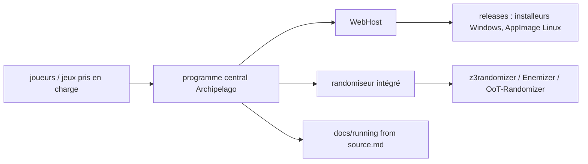

# ArchipelagoMW/Archipelago

> **Un cadre générique de « multiworld » pour randomiseurs de jeux vidéo**, qui est aussi le randomiseur lui-même.

## Le problème

Les randomiseurs de jeux existent un par jeu, chacun avec son format et sa logique. Faire jouer
plusieurs personnes sur plusieurs jeux différents dans une même partie liée demande, sans cadre
commun, de réécrire cette mécanique à chaque fois.

## Ce que ça fait vraiment

Le README annonce un cadre générique pour développer une capacité multiworld dans des
randomiseurs, en précisant que, dans tous les cas à ce jour, Archipelago est aussi le
randomiseur lui-même. Il liste une centaine de jeux pris en charge, de *A Link to the Past* à
*Factorio*, *Stardew Valley*, *Starcraft 2*, *Civilization VI* ou *Satisfactory*. Le dépôt
contient aussi un WebHost et un programme central, mentionnés dans les consignes de
contribution. Le fonctionnement fin (protocole, génération, appariement des objets) n'est pas
documenté dans le README : il renvoie vers le site pour les tutoriels et la FAQ.

## Comment c'est branché

Aucun diagramme n'existe pour ce dépôt ; ce qui suit est reconstruit depuis le README seul.



Le README nomme trois dépôts utilisés par le projet (`z3randomizer`, `Enemizer`,
`OoT-Randomizer`) et deux fichiers de documentation : `docs/running%20from%20source.md` et
`/docs/contributing.md`.

## Essayer

```bash
# aucune commande d'installation documentée dans le README
```

Le README dit d'aller sur la page des *Releases* et de lancer l'installeur approprié, ou
l'AppImage sur Linux. Pour développer, ou sur une plateforme sans release compilée, il renvoie
à `docs/running from source.md`, dont le contenu n'est pas reproduit ici.

## Coût et pièges

Rien à payer, rien à créer comme compte selon le README. Le piège principal est la licence :
le catalogue la donne comme NOASSERTION, c'est-à-dire non identifiée automatiquement — à
vérifier dans le dépôt avant toute réutilisation de code. Second piège : jouer suppose de
posséder les jeux concernés et, le plus souvent, leurs ROMs ou fichiers d'origine, ce que le
README ne discute pas. La distribution principale vise Windows (binaires compilés) et Linux
(AppImage) ; rien n'est dit sur macOS.

## Ce que ce n'est pas

Ce n'est pas une bibliothèque Python qu'on installe avec pip pour l'intégrer ailleurs : c'est
une application livrée par installeur. Ce n'est pas non plus un cadre déjà découplé de son
randomiseur — le README le dit explicitement, Archipelago *est* le randomiseur. Enfin ce n'est
pas un outil de data ou d'IA malgré le langage Python : le domaine est le jeu vidéo.

## Alternatives

Le README ne cite que des ancêtres et des dépendances, pas des concurrents : bonta0's
MultiWorld, AmazingAmpharos' Entrance Randomizer, le VT Web Randomizer et l'alttprandomizer de
Dessyreqt sont des randomiseurs mono-jeu dont Archipelago est issu ou s'inspire ; `z3randomizer`,
`Enemizer` et `OoT-Randomizer` sont utilisés par le projet. Pour un équivalent multiworld
multi-jeux, aucune alternative comparable dans le catalogue.

## Pour toi

Sans intérêt professionnel pour un profil data / IA / MLOps : aucun rapport avec les données,
les modèles ou le déploiement. À regarder seulement par curiosité de loisir, ou comme exemple
de gros projet Python communautaire avec une base de contributeurs très large.
