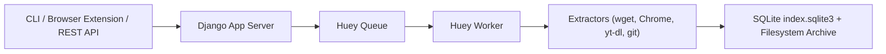

# ArchiveBox/ArchiveBox

> Application auto-hébergée qui archive des pages web en formats durables, pour particuliers et organisations.

## Le problème
Les pages disparaissent (link rot) ou changent, et les services d'archive publics ne gardent pas le contenu privé ou derrière connexion.

## Ce que ça fait vraiment
Tu lui donnes des URL (CLI, interface web, API REST, extension navigateur, imports de flux RSS ou marque-pages). Il enregistre chaque page en plusieurs formats : HTML, SingleFile, PDF, capture PNG, WARC, texte d'article, médias via yt-dlp, clone git. L'index est en SQLite et les fichiers sur disque. Par défaut il soumet aussi les pages à archive.org, désactivable.

## Comment c'est branché


## Essayer
```bash
mkdir -p ~/archivebox/data && cd ~/archivebox
curl -fsSL 'https://docker-compose.archivebox.io' > docker-compose.yml
docker compose pull
docker compose up -d --wait
docker compose exec archivebox archivebox add 'https://example.com'
```

## Coût et pièges
Disque : de ~1 Go à ~50 Go par millier de pages selon l'activation de yt-dlp. Le contenu privé peut fuiter vers des tiers (archive.org) ; le README recommande de désactiver des extracteurs. Le JS archivé est non fiable. Windows non supporté hors Docker/WSL.

## Ce que ce n'est pas
Ce n'est ni le plus fidèle ni le plus simple des archiveurs, le README le dit lui-même. L'API REST est annoncée alpha, l'API Python bêta.

## Alternatives
- ArchiveWeb.page et ReplayWeb.page : meilleure fidélité pour les pages interactives.
- Browsertrix : crawl récursif avancé.
- Memex, Hoarder, LinkWarden : plus de fonctions de marque-pages et notes.

## Pour toi
Surveiller : utile pour figer des sources de veille ou articles de recherche, à l'infrastructure raisonnable, sans lien direct avec tes pipelines.

