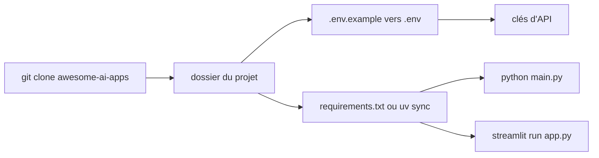

# Arindam200/awesome-ai-apps

> Collection de 132 projets d'exemple couvrant agents, RAG, voix, MCP et fine-tuning.

## Le problème
Choisir entre LangGraph, CrewAI, Agno, Mastra, ADK ou Semantic Kernel sans écrire
six fois le même agent pour comparer.

## Ce que ça fait vraiment
Classe 132 projets exécutables en sept familles : 21 « starter agents » (un par
framework — AutoGen, AWS Strands, CAMEL, CrewAI, DSPy, Google ADK, smolagents,
LangChain, LangGraph, Letta, LlamaIndex, Mastra, Microsoft Agent Framework, OpenAI
Agents SDK, PydanticAI, Semantic Kernel), 18 agents simples, 9 agents vocaux
(LiveKit, Pipecat, Deepgram), 14 agents MCP, 13 agents à mémoire (Memori, Agno), 18
applications RAG (GraphRAG Neo4j, RAG PDF avec reranking Qdrant, RAG typé
LlamaIndex, RAG de confiance avec vérification de citations), 34 agents avancés
multi-agents, et 6 exemples de fine-tuning bout en bout.

## Comment c'est branché


## Essayer
```bash
git clone https://github.com/Arindam200/awesome-ai-apps.git
cd starter_ai_agents/agno_starter
cp .env.example .env
uv sync
streamlit run app.py
```

## Coût et pièges
Le dépôt est gratuit, mais presque chaque projet demande des clés d'API, et une
grande partie est explicitement « powered by Nebius Token Factory » — le sponsor
transparaît dans les choix d'implémentation. Python 3.10+, 3.11+ recommandé pour
les projets récents.

## Ce que ce n'est pas
Pas une bibliothèque : rien à installer, rien à importer. Pas de garantie que les
132 projets tournent encore — c'est une vitrine, pas une suite testée. Les
descriptions viennent du mainteneur.

## Alternatives
- Aucun dépôt alternatif nommé dans le README.

## Pour toi
Bon catalogue à parcourir pour repérer un patron d'implémentation (le RAG PDF avec
reranking, le RAG à citations vérifiées), à condition de filtrer les exemples
sponsorisés.
