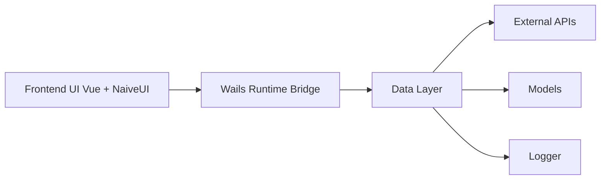

# ArvinLovegood/go-stock

> Application de bureau d'analyse boursière (A/HK/US) pilotée par des LLM, en chinois.

## Le problème
Suivre les cours, les actualités et les signaux techniques chinois oblige à jongler entre plusieurs sites financiers.

## Ce que ça fait vraiment
Application Wails (Go + Vue/NaiveUI) : cotations, K-lines avec de nombreux indicateurs, flux de capitaux, fonds et ETF.
Agents IA (React / PlanExecute / DeepAgents), plus de 150 outils de données, MCP, skills, vision.
Backtest de prompts et de recommandations, revue quotidienne, alertes Feishu/DingTalk.
Compatible OpenAI, Ollama, DeepSeek et de nombreux fournisseurs chinois.

## Comment c'est branché

## Essayer
Aucune commande documentée : seulement des binaires à télécharger (Windows, macOS).

## Coût et pièges
Clé LLM à ta charge ; certaines fonctions (actualités synchronisées) sont réservées aux abonnés VIP payants. Développé surtout pour Windows.

## Ce que ce n'est pas
Pas un conseil en investissement : le README dit « pour le divertissement ». Rien n'est testé hors de Windows.

## Alternatives
Aucune alternative nommée dans le README.

## Pour toi
À ignorer : outil grand public centré sur le marché chinois, avec un modèle freemium, sans valeur pour un pipeline data ou ML.
