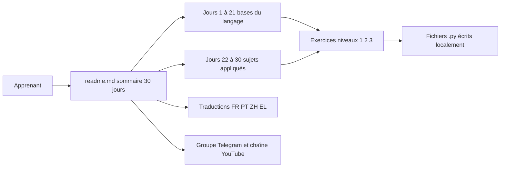

# Asabeneh/30-Days-Of-Python

> **A thirty-step Python course, from variables to an API, for beginners who want practice.**

## The problem

Learning Python alone means stacking up unrelated tutorials with no progression and no exercises,
and quitting before writing anything useful. The README lays out an ordered path, one day at a
time, with exercises at each step and a stated pace of 30 to 100 days.

## What it actually does

This is a documentation repository, not a package to install. The README is the table of contents
for the course: 30 markdown files, one per day, from "Introduction" (day 1) to "Conclusions"
(day 30), covering the basic types (strings, lists, tuples, sets, dictionaries), functions and
modules, error handling, regular expressions, file handling, classes, then applied topics: web
scraping, virtual environments, statistics, Pandas, Python web, MongoDB, consuming an API and
building an API.
Each day, according to the README, contains explanations, examples and exercises split into three
levels. The README also covers installing Python and Visual Studio Code, using the interactive
shell, and indentation. Community translations are listed: Portuguese, Chinese, French, Greek.

## How it is wired



There is no software architecture: the entry point is the README, which links to one folder per
day (`02_Day_Variables_builtin_functions/`, `25_Day_Pandas/`, `29_Day_Building_API/`…). The code
a learner writes lives on their own machine, in a `30DaysOfPython` folder created by hand, with a
first `helloworld.py` file. The side resources — Telegram group, YouTube channel — are outside the
repository.

## Trying it

```shell
python3 --version
```

```shell
python
```

The README documents no installation of the repository itself: you check your Python version
(3.6 or above per the text), open the interactive shell, and read the files day by day. Creating a
`30DaysOfPython` folder and a `helloworld.py` file is the only setup described.

## Cost and traps

Free, nothing to install beyond Python and an editor (VS Code is the author's recommendation). The
real cost is time: the README itself announces 30 to 100 days and calls the challenge "very
demanding". No license is declared, so nothing formally allows reusing the material for internal
training. The repository rests on a single author, with sponsoring calls (GitHub Sponsors, PayPal)
and pointers to a YouTube channel and a Telegram group — external dependencies that may vanish.
The second edition is dated July 2021 in the README, so some versions and screenshots are old (the
author mentions Python 3.7.5).

## What it is not

Neither a library nor a tool: nothing to import, no API. It is also not a data science or machine
learning course — Pandas and statistics take up only two days out of thirty, and the table of
contents mentions neither numpy nor scikit-learn. The "certificate" it mentions carries no
institutional value. Finally, the translations are community-made and nothing indicates they track
the English version.

## Alternatives

- `donnemartin/data-science-ipython-notebooks`: a better fit when the goal is data science in
  notebooks rather than the language basics.
- `pandas-dev/pandas`: the official documentation is the right source for day 25, far more complete
  than one chapter.
- `Sinaptik-AI/pandas-ai` and `DedSecInside/TorBot` are not comparable: they are tools, not
  teaching material.

## For you

Little value if you already write Python daily. It is however a clean reference to hand to a
business colleague or an intern starting out, and days 22 to 30 (scraping, virtual environments,
APIs) cover exactly the gaps usually found in self-taught profiles. Worth a bookmark, not adoption.
