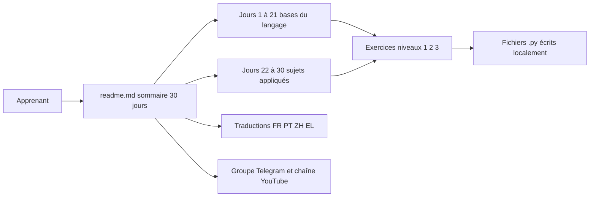

# Asabeneh/30-Days-Of-Python

> **Cours Python en trente étapes, des variables à une API, pour débutants qui veulent pratiquer.**

## Le problème

Apprendre Python seul, c'est empiler des tutoriels sans progression ni exercices, et abandonner
avant d'avoir écrit quoi que ce soit d'utile. Le README pose un parcours ordonné, jour par jour,
avec des exercices à chaque étape et un rythme annoncé de 30 à 100 jours.

## Ce que ça fait vraiment

C'est un dépôt de documentation, pas un paquet à installer. Le README est le sommaire du
parcours : 30 fichiers markdown, un par jour, de « Introduction » (jour 1) à « Conclusions »
(jour 30), en passant par les types de base (chaînes, listes, tuples, ensembles, dictionnaires),
les fonctions et modules, la gestion d'erreurs, les expressions régulières, les fichiers, les
classes, puis des sujets appliqués : web scraping, environnement virtuel, statistiques, Pandas,
Python web, MongoDB, consommation d'API et construction d'une API.
Chaque jour contient, d'après le README, des explications, des exemples et des exercices
répartis en trois niveaux. Le README traite aussi l'installation de Python et de Visual Studio
Code, l'usage du shell interactif et la notion d'indentation.
Des traductions communautaires sont listées : portugais, chinois, français, grec.

## Comment c'est branché



Il n'y a pas d'architecture logicielle : le point d'entrée est le README, qui renvoie vers un
dossier par jour (`02_Day_Variables_builtin_functions/`, `25_Day_Pandas/`, `29_Day_Building_API/`…).
Le code que l'apprenant écrit vit chez lui, dans un dossier `30DaysOfPython` créé à la main,
avec un premier fichier `helloworld.py`. Les ressources annexes — groupe Telegram, chaîne
YouTube — sont hors dépôt.

## Essayer

```shell
python3 --version
```

```shell
python
```

Le README ne documente aucune installation du dépôt lui-même : on vérifie sa version de Python
(3.6 ou plus d'après le texte), on ouvre le shell interactif, et on lit les fichiers jour après
jour. Créer un dossier `30DaysOfPython` puis un fichier `helloworld.py` est la seule mise en
route décrite.

## Coût et pièges

Gratuit, rien à installer hors Python et un éditeur (VS Code recommandé par l'auteur). Le vrai
coût est le temps : le README annonce lui-même 30 à 100 jours et se décrit comme « very
demanding ». La licence n'est pas déclarée : rien n'autorise formellement la réutilisation du
contenu en formation interne. Le dépôt repose sur un auteur unique, avec appels au sponsoring
(GitHub Sponsors, PayPal) et renvoi vers une chaîne YouTube et un groupe Telegram — dépendances
externes qui peuvent disparaître. La seconde édition est datée de juillet 2021 dans le README :
certaines versions et captures sont anciennes (l'auteur y mentionne Python 3.7.5).

## Ce que ce n'est pas

Ce n'est ni une bibliothèque ni un outil : rien à importer, aucune API. Ce n'est pas non plus un
cours de data science ou de machine learning — Pandas et les statistiques n'occupent que deux
jours sur trente, et le README ne mentionne ni numpy ni scikit-learn dans le sommaire. Le
« certificat » évoqué n'a pas de valeur institutionnelle. Enfin, les traductions sont
communautaires et rien n'indique qu'elles suivent la version anglaise.

## Alternatives

- `donnemartin/data-science-ipython-notebooks` : à préférer si l'objectif est la data science en
  notebooks plutôt que les bases du langage.
- `pandas-dev/pandas` : la documentation officielle est la bonne source pour le jour 25, bien
  plus complète qu'un chapitre.
- `Sinaptik-AI/pandas-ai` et `DedSecInside/TorBot` ne sont pas comparables : ce sont des outils,
  pas du matériel pédagogique.

## Pour toi

Peu d'intérêt si tu fais déjà du Python au quotidien. C'est en revanche une référence propre à
donner à un collègue métier ou à un stagiaire qui débute, et les jours 22 à 30 (scraping,
environnements virtuels, API) couvrent exactement les lacunes qu'on retrouve chez les
autodidactes. À garder en marque-page, pas à adopter.
