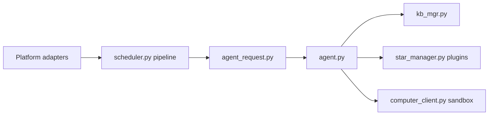

# AstrBotDevs/AstrBot

> Plateforme de chatbot agent multi-messageries, avec plugins et bac à sable, pour intégrateurs.

## Le problème
Déployer un agent LLM sur QQ, Feishu, Telegram, Slack avec outils et base de connaissances demande beaucoup de plomberie.

## Ce que ça fait vraiment
Des adaptateurs de plateformes injectent les messages dans un pipeline d'événements (prétraitement, requête agent, réponse). Runtime agent avec fournisseurs de modèles, base de connaissances vectorielle, plugins (1000+ annoncés), skills, MCP, bac à sable d'exécution de code. WebUI d'administration, base SQLite.

## Comment c'est branché


## Essayer
```bash
uv tool install astrbot --python 3.12
astrbot init
astrbot run
```

## Coût et pièges
Clé d'API LLM à ta charge (ou Dify, Coze, Bailian). AGPL-3.0 : contraignant si tu l'exposes en service modifié. 1 523 issues ouvertes.

## Ce que ce n'est pas
Pas une bibliothèque ; écosystème centré sur les messageries chinoises. Le câblage détaillé n'est pas vérifié par l'architecture.

## Alternatives
Aucune nommée dans le README.

## Pour toi
Même créneau que CowAgent ; à surveiller seulement pour un bot interne sur messagerie.
