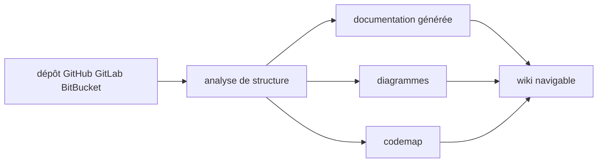

# AsyncFuncAI/deepwiki-open

> Génère automatiquement un wiki interactif et des diagrammes pour un dépôt GitHub, GitLab ou BitBucket.

## Le problème
Arriver sur un dépôt inconnu demande des heures avant de comprendre sa structure et ses flux.
La documentation, quand elle existe, décrit rarement le code tel qu'il est aujourd'hui.

## Ce que ça fait vraiment
Cinq étapes annoncées : analyse de la structure du code, génération de documentation, diagrammes visuels,
organisation en wiki navigable, et production d'une « codemap » pour des visites guidées du code.
Il suffit d'entrer un nom de dépôt. Le README est traduit en dix langues.
La version 2.0 est annoncée sous le nom Grok Wiki, à télécharger sur un site externe.

## Comment c'est branché

## Essayer
Aucune commande documentée dans le README : il renvoie à `https://grok-wiki.com`.

## Coût et pièges
Rien d'indiqué : ni modèle utilisé, ni clé d'API, ni ce qui tourne en local par rapport au service hébergé.

## Ce que ce n'est pas
Pas une réimplémentation officielle : l'auteur le présente comme sa propre tentative d'implémentation de DeepWiki.
Pas documenté comme logiciel auto-hébergeable ici : le chemin mis en avant est un téléchargement externe.
Pas évaluable en l'état : ce README fait moins de 800 caractères utiles.

## Alternatives
Aucune nommée dans le README.

## Pour toi
L'idée est exactement ton besoin d'onboarding sur un dépôt — mais rien dans ce README ne permet de l'essayer.
