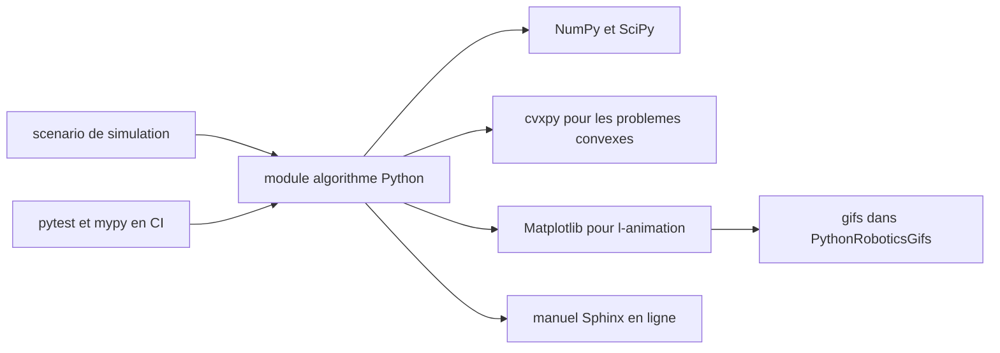

# AtsushiSakai/PythonRobotics

> **A collection of Python robotics algorithm scripts plus a textbook, meant to be read and learned from.**

## The problem

Without this repository, understanding an extended Kalman filter, an RRT* or an MPC path
tracker means reading an academic paper and reimplementing it yourself, or digging through a
full robotics stack where the algorithm is buried under infrastructure. The README states its
goals plainly: each algorithm should be easy to read, the selected algorithms should be widely
used, and dependencies should stay minimal.

## What it actually does

The repository gathers standalone Python scripts, one per algorithm, each with an animation and
its bibliographic references. The families listed in the README: localization (extended Kalman
filter, particle filter, histogram filter), mapping (Gaussian grid map, ray casting grid map,
lidar to grid map, k-means clustering, rectangle fitting), SLAM (ICP matching, FastSLAM 1.0),
path planning (Dijkstra, A*, D*, D* Lite, potential field, grid based coverage, particle swarm
optimization, state lattice, PRM, RRT*, LQR-RRT*, quintic polynomials, Reeds-Shepp, Frenet
frame), path tracking (move to pose, Stanley, rear wheel feedback, LQR, iterative linear MPC,
C-GMRES NMPC), arm navigation, aerial navigation (drone trajectory following, rocket powered
landing) and a bipedal planner with an inverted pendulum. Alongside the code, the README points
to an online textbook with the mathematical background, an arXiv paper (1808.10703) and a
separate PythonRoboticsGifs repository that hosts the animations.

## How it is wired



Each script is run directly from its own directory: it sets up its own scenario, calls its
algorithm routine built on NumPy and SciPy, and renders the result with Matplotlib. cvxpy is
only involved in convex optimization formulations. Published animations live in the separate
PythonRoboticsGifs repository, and the mathematical documentation is generated with Sphinx.
According to the README badges, CI runs on Linux, macOS and Windows, with pytest, pytest-xdist,
mypy and pycodestyle listed as development requirements.

## Trying it

```terminal
git clone https://github.com/AtsushiSakai/PythonRobotics.git
```

```terminal
conda env create -f requirements/environment.yml
```

```terminal
pip install -r requirements/requirements.txt
```

Then, per the README: "Execute python script in each directory." No specific run command for an
individual script is documented in the README.

## Cost and traps

Nothing to pay: no API key, no GPU, no third-party service. The README requires Python 3.13.x,
which is a hard constraint if your environment is pinned to an older version. cvxpy is the
heaviest dependency of the set. The real trap lies elsewhere: the README only shows a few
examples and defers everything else to the online textbook, so the repository alone is not
enough to navigate the material. Finally, the README states MIT, while the catalog-side
detected license is NOASSERTION — check the license file before any product use.

## What it is not

This is not a deployable robotics stack nor a framework to import into a real robot: these are
pedagogical simulation scripts, written to be read. The README documents no packaged install,
no stable API, no ROS integration, no real-time or hardware support. It is not a model
repository either: everything is algorithmic and deterministic, with no learned components.

## Alternatives

- ShisatoYano/AutonomousVehicleControlBeginnersGuide (catalog neighbor): same teaching spirit
  but focused on autonomous vehicles, where PythonRobotics spans localization, SLAM, arms and
  aerial navigation.
- ghliu/pyReedsShepp, cited in the README: preferable if you only want Reeds-Shepp curves
  without the rest of the collection.
- MahanFathi/LQR-RRTstar, cited in the README: a dedicated LQR-RRT* implementation if that is
  the only algorithm you are after.

## For you

For a data / AI / MLOps profile, this is a reference to keep at hand whenever a topic touches
trajectories, state estimation or control: the implementations are short, readable and sourced,
which makes them excellent material for understanding and prototyping. Do not mistake it for a
production building block — you take ideas and reference code from it, not a runtime dependency.
