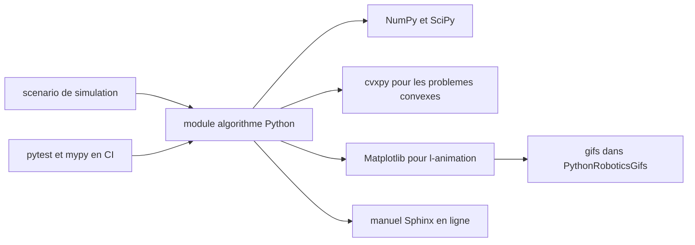

# AtsushiSakai/PythonRobotics

> **Collection de scripts Python d'algorithmes de robotique, doublée d'un manuel, pour apprendre en lisant le code.**

## Le problème

Sans ce dépôt, comprendre un filtre de Kalman étendu, un RRT* ou un MPC de suivi de trajectoire
suppose de lire un article académique puis de le réimplémenter soi-même, ou d'ouvrir une pile
robotique complète où l'algorithme est noyé dans l'infrastructure. Le README pose explicitement
comme objectifs la lisibilité de chaque algorithme et un minimum de dépendances.

## Ce que ça fait vraiment

Le dépôt rassemble des scripts Python autonomes, un par algorithme, chacun accompagné d'une
animation et de ses références bibliographiques. Les familles couvertes, telles que listées dans
le README : localisation (filtre de Kalman étendu, filtre particulaire, filtre à histogramme),
cartographie (grille gaussienne, ray casting, lidar vers grille, k-means, ajustement de
rectangles), SLAM (ICP, FastSLAM 1.0), planification de chemin (Dijkstra, A*, D*, D* Lite,
champ de potentiel, couverture de grille, PSO, state lattice, PRM, RRT*, LQR-RRT*, polynômes
quintiques, Reeds-Shepp, Frenet), suivi de trajectoire (move to pose, Stanley, retour roue
arrière, LQR, MPC linéaire itératif, NMPC C-GMRES), navigation de bras, navigation aérienne
(drone, atterrissage propulsé de fusée) et un planificateur bipède à pendule inversé.
À côté du code, le README pointe un manuel en ligne qui donne les fondements mathématiques,
un article arXiv (1808.10703) et un dépôt séparé PythonRoboticsGifs qui héberge les animations.

## Comment c'est branché



Chaque script est exécuté directement depuis son répertoire : il pose son propre scénario,
appelle sa routine d'algorithme construite sur NumPy et SciPy, et affiche le résultat avec
Matplotlib. cvxpy n'intervient que pour les formulations d'optimisation convexe. Les animations
publiées sont stockées dans le dépôt séparé PythonRoboticsGifs, et la documentation
mathématique est générée avec Sphinx. La CI, d'après les badges du README, tourne sur Linux,
macOS et Windows, avec pytest, pytest-xdist, mypy et pycodestyle pour le développement.

## Essayer

```terminal
git clone https://github.com/AtsushiSakai/PythonRobotics.git
```

```terminal
conda env create -f requirements/environment.yml
```

```terminal
pip install -r requirements/requirements.txt
```

Puis, selon le README : « Execute python script in each directory. » Aucune commande précise
d'exécution d'un script donné n'est documentée dans le README.

## Coût et pièges

Rien à payer : pas de clé d'API, pas de GPU, pas de service tiers. Le README exige Python 3.13.x,
ce qui est une contrainte forte si l'environnement de travail est figé sur une version plus
ancienne. cvxpy est une dépendance lourde comparée au reste. Le piège réel est ailleurs :
le README ne montre que quelques exemples et renvoie pour tout le reste au manuel en ligne,
donc le dépôt seul ne suffit pas à se repérer. Enfin, la licence affichée dans le README est
MIT, mais la licence détectée côté catalogue est NOASSERTION — à vérifier dans le fichier de
licence avant tout usage en produit.

## Ce que ce n'est pas

Ce n'est pas une pile robotique déployable ni un framework à importer dans un robot réel :
ce sont des scripts de simulation pédagogiques, pensés pour être lus. Le README ne documente
aucune installation en tant que paquet, aucune API stable, aucune intégration ROS, aucun
support temps réel ni matériel. Ce n'est pas non plus un dépôt de modèles entraînés : tout est
algorithmique et déterministe, sans apprentissage.

## Alternatives

- ShisatoYano/AutonomousVehicleControlBeginnersGuide (voisin du catalogue) : même esprit
  pédagogique mais centré sur le véhicule autonome, là où PythonRobotics ratisse localisation,
  SLAM, bras et aérien.
- ghliu/pyReedsShepp, cité dans le README : à préférer si l'on ne veut que les courbes
  Reeds-Shepp sans le reste de la collection.
- MahanFathi/LQR-RRTstar, cité dans le README : implémentation dédiée de LQR-RRT* si c'est le
  seul algorithme recherché.

## Pour toi

Pour un profil data / IA / MLOps, c'est une référence à garder sous la main dès qu'un sujet
touche à la trajectoire, à l'estimation d'état ou au contrôle : les implémentations sont
courtes, lisibles et sourcées, ce qui en fait un excellent matériau de compréhension et de
prototypage. À ne pas confondre avec une brique de production — on y pioche des idées et du
code de référence, pas une dépendance à mettre en service.
