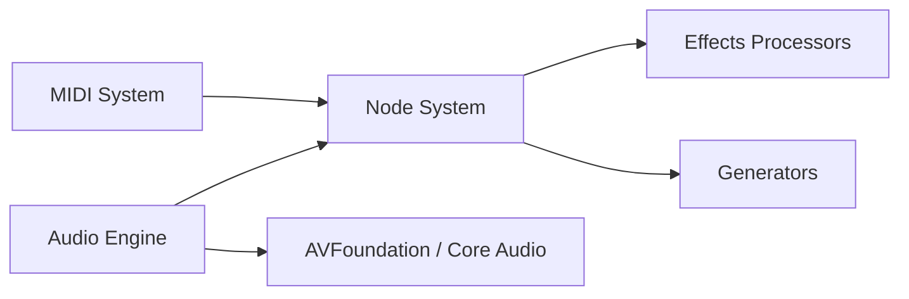

# AudioKit/AudioKit

> Plateforme de synthèse, traitement et analyse audio pour développeurs iOS, macOS et tvOS.

## Le problème
Construire des apps audio sur les plateformes Apple demande de maîtriser les API bas niveau.

## Ce que ça fait vraiment
Un moteur audio central relie des nœuds (effets, générateurs, lecture, mixage), avec MIDI, gestion de fichiers audio et « taps » d'analyse. D'après l'architecture décrite : s'appuie sur AVFoundation et Core Audio.

## Comment c'est branché

## Essayer
Installation via Xcode : `File` → `Add Package Dependencies…`, puis ajout de la collection `https://swiftpackageindex.com/AudioKit/collection.json`. Aucune commande shell.

## Coût et pièges
Gratuit. Réservé à l'écosystème Apple et à Xcode. Le README sollicite du sponsoring.

## Ce que ce n'est pas
Pas un outil d'analyse audio pour du machine learning côté Python : c'est du Swift pour apps Apple.

## Alternatives
Aucune alternative nommée dans le README.

## Pour toi
Ignorer : cible le développement d'apps audio Apple, sans rapport avec les pipelines data/IA.

