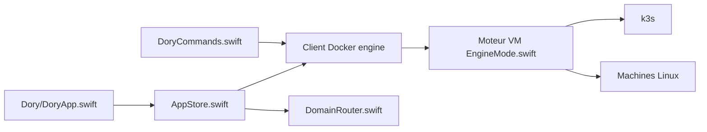

# Augani/dory

> Runtime local pour Mac Apple Silicon : Docker, Kubernetes, machines Linux et bacs à sable pour agents.

## Le problème
Sur Mac, il faut cumuler Docker Desktop, un gestionnaire de VM et un cluster local, avec des comptes, des licences commerciales ou de la télémétrie.

## Ce que ça fait vraiment
Une application SwiftUI et une CLI `dory` qui fournissent un moteur Docker partagé (Compose, Buildx), un k3s en un clic, des machines Linux séparées (bureaux Ubuntu, Debian, Kali ou Alpine headless), l'import depuis Docker Desktop, OrbStack, Colima ou Podman, et des bacs à sable VM pour agents. Un serveur MCP (`dory mcp serve --read-only`) donne aux agents l'accès à l'état de l'engine. Composants optionnels signés et installés à la demande.

## Comment c'est branché


## Essayer
```bash
brew install --cask Augani/dory/dory
docker context use dory
docker run --rm hello-world
dory doctor --active
dory sandbox run --json --network none --rollback -- /bin/sh -lc 'uname -a'
```

## Coût et pièges
Gratuit, sans compte ni télémétrie, mais réservé à Apple Silicon sous macOS 14+, avec 8 Gio de RAM recommandés. Plusieurs fonctions (bureaux Linux, GPU, USB) sont annoncées non qualifiées pour la publication.

## Ce que ce n'est pas
Pas un outil Linux ni Intel. Le README lui-même liste des limites : pas de passthrough USB ou audio, ISO x86_64 refusées.

## Alternatives
OrbStack, Colima, Rancher Desktop ou Podman (cités comme sources de migration).

## Pour toi
À surveiller : intéressant pour un poste Mac de développement MLOps (Docker, k3s, sandboxes), mais version 0.4, GPL-3.0 et mainteneur unique.
