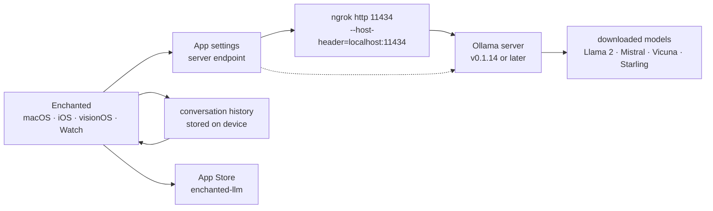

# AugustDev/enchanted

> **A macOS/iOS/visionOS chat app that talks to your own Ollama server, not to a vendor.**

## The problem

Running a model at home with Ollama gives you an HTTP API on `localhost:11434` and nothing
else: to actually hold a conversation you are left with `curl` or a web page opened on the
machine that hosts it. From an iPhone, an Apple Watch or a Vision Pro there is no obvious
route to that server, and mainstream chat apps point by construction at a remote provider
rather than at your own models.

## What it actually does

Enchanted is a native Swift app for macOS, iOS and visionOS that the README describes as
"essentially ChatGPT app UI" wired to privately hosted models — Llama 2, Mistral, Vicuna and
Starling are the examples given. It runs no model itself: it is a client of an Ollama server
whose address you enter in the app settings.

The README lists the features that are actually present: conversation history stored on the
device and included in the API calls, text to speech (read aloud), voice prompts, image
attachments for prompts (multimodal), Markdown rendering of tables, lists and code blocks,
dark/light mode, a system prompt applied to every conversation, editing a message or
resubmitting it against a different model, deleting one conversation or all of them, reusable
custom prompt templates, and a Spotlight-style panel on macOS opened with
<kbd>Ctrl</kbd>+<kbd>⌘</kbd>+<kbd>K</kbd>. The README states that all features work offline —
meaning nothing transits through a service run by the author; the Ollama server is of course
still required.

The very first thing the README says, before the description: "[Jaz](https://github.com/gluonfield/jaz)
is the new iteration of this project." The author points elsewhere himself.

## How it is wired



No code-derived diagram exists for this repository: this schema is rebuilt from the README
alone. There is no server component owned by the project — the only link that matters is the
URL typed into the settings, pointing either straight at an already reachable Ollama or at an
`ngrok` tunnel when Ollama runs on a workstation.

## Trying it

The README documents no build from source: the described path goes through the App Store.

Case 1, Ollama server already publicly reachable:

1. Download Enchanted from the App Store.
2. Specify your server endpoint in App Settings.

Case 2, Ollama on your own computer — the only command the README gives:

```shell
ngrok http 11434 --host-header="localhost:11434"
```

Then copy the "Forwarding" URL (shaped like `https://b377-82-132-216-51.ngrok-free.app`) and
paste it as the server endpoint in App Settings.

## Cost and traps

- **Nothing works without your own Ollama server.** The README flags this right in the App
  Store section: you host it, maintain it and download the models into it. The app is the
  client, not the engine.
- **Minimum Ollama version: v0.1.14**, stated explicitly.
- **The `ngrok` tunnel is the real security trap.** The suggested procedure exposes an
  unauthenticated Ollama API on a public URL, described as temporary and free. Anyone who
  knows the URL can query the model. The README documents neither a token nor any access
  restriction.
- **Apple ecosystem only**: macOS, iOS, visionOS, Watch. No Android, no Windows, no Linux, no
  web client.
- **License not recorded in the catalogue** for this repository, although the README calls it
  open source: check the repository's license file before any corporate use or redistribution.
- **One-person project**: a single named author (Augustinas Malinauskas), an email contact,
  and a header line pointing to a successor project.
- The compute cost is the one your local models already carry: the app neither adds to it nor
  removes it.

## What it is not

- **It is not an inference engine.** No model is bundled or executed by the app; without
  Ollama on the other side there is nothing to query.
- **"Offline" does not mean "without a network".** The README says all features work offline,
  in the sense of without a third-party service run by the author; you still have to reach
  your Ollama server over the network.
- **It is not a gateway to commercial APIs**: the README mentions only Ollama compatibility
  and privately hosted models.
- **It is not the project the author works on today**: the first line of the README names
  `gluonfield/jaz` as the new iteration. Nothing in the README promises continued updates here.
- **It is not a secure remote-access solution**: `ngrok` publishes the API, it does not
  protect it.

## Alternatives

No comparable alternative in the catalogue: the batch line offers no authorised neighbours for
this repository, the lexical matching having found nothing close enough to a Swift app acting
as an Ollama client. The only repositories named in the README are **jmorganca/ollama**, which
is not an alternative but the mandatory server dependency, and **gluonfield/jaz**, presented by
the author as the new iteration of the project — that is where to look before investing here.

## For you

Limited interest on the data / AI side: this is a consumer chat app, not a scriptable work
tool — no API, no notebook integration, no batch processing. The reason to keep an eye on it is
different: it is a readable example of a native client for an Ollama API, and a convenient way
to query a model running on your workstation from a phone. Watch rather than adopt, first
because the author himself redirects to `jaz`, and second because the documented access path
(`ngrok` without authentication) does not hold up in a professional setting.
