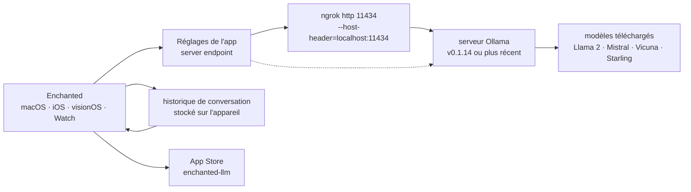

# AugustDev/enchanted

> **Client de conversation macOS/iOS/visionOS qui parle à ton propre serveur Ollama, pas à un fournisseur.**

## Le problème

Faire tourner un modèle chez soi avec Ollama donne une API HTTP sur `localhost:11434`, et rien
de plus : pour converser, il reste `curl` ou une page web à ouvrir sur la machine qui héberge.
Depuis un iPhone, une Apple Watch ou un Vision Pro, il n'y a pas de chemin évident vers ce
serveur, et les applications de conversation grand public renvoient par construction vers un
fournisseur distant plutôt que vers ses propres modèles.

## Ce que ça fait vraiment

Enchanted est une application Swift native pour macOS, iOS et visionOS que le README décrit
comme « essentiellement l'interface de l'application ChatGPT » branchée sur des modèles
hébergés en privé — Llama 2, Mistral, Vicuna, Starling sont les exemples cités. Elle ne fait
tourner aucun modèle : elle est cliente d'un serveur Ollama dont on lui donne l'adresse dans
les réglages.

Le README liste les fonctions réellement présentes : historique de conversation stocké sur
l'appareil et réinjecté dans les appels d'API, synthèse vocale (lecture à voix haute), invites
vocales, pièces jointes images pour les invites (multimodal), rendu Markdown des tableaux,
listes et blocs de code, thème clair/sombre, invite système définie pour toutes les
conversations, édition d'un message ou renvoi vers un autre modèle, suppression d'une
conversation ou de toutes, gabarits d'invites réutilisables, et un panneau à la Spotlight sur
macOS ouvert par <kbd>Ctrl</kbd>+<kbd>⌘</kbd>+<kbd>K</kbd>. Le README annonce que toutes les
fonctions marchent hors ligne — au sens où rien ne transite par un service de l'auteur, le
serveur Ollama restant évidemment nécessaire.

Première chose à lire dans le README, avant la description : « [Jaz](https://github.com/gluonfield/jaz)
est la nouvelle itération de ce projet. » L'auteur pointe donc lui-même ailleurs.

## Comment c'est branché



Aucun diagramme tiré du code n'existe pour ce dépôt : ce schéma est reconstruit depuis le seul
README. Il n'y a pas de composant serveur appartenant au projet — le seul lien qui compte est
l'URL saisie dans les réglages, soit directement vers un Ollama déjà accessible, soit vers un
tunnel `ngrok` quand l'Ollama tourne sur un poste de travail.

## Essayer

Le README ne documente pas de compilation depuis les sources : le chemin décrit passe par
l'App Store.

Cas 1, serveur Ollama déjà accessible publiquement :

1. Télécharger Enchanted depuis l'App Store.
2. Indiquer l'adresse du serveur dans les réglages de l'application.

Cas 2, Ollama sur son ordinateur — la seule commande donnée par le README :

```shell
ngrok http 11434 --host-header="localhost:11434"
```

Puis copier l'URL de « Forwarding » (de la forme `https://b377-82-132-216-51.ngrok-free.app`)
et la coller comme adresse de serveur dans les réglages de l'application.

## Coût et pièges

- **Rien ne marche sans un serveur Ollama à soi.** Le README le signale dès la section App
  Store : il faut l'héberger, le maintenir et y télécharger les modèles. L'application est le
  client, pas le moteur.
- **Version minimale d'Ollama : v0.1.14**, écrite noir sur blanc.
- **Le tunnel `ngrok` est le vrai piège de sécurité.** La procédure proposée expose une API
  Ollama sans authentification sur une URL publique, décrite comme temporaire et gratuite.
  Quiconque connaît l'URL peut interroger le modèle. Le README ne documente ni jeton, ni
  restriction d'accès.
- **Écosystème Apple uniquement** : macOS, iOS, visionOS, Watch. Pas d'Android, pas de Windows,
  pas de Linux, pas de client web.
- **Licence non renseignée dans le catalogue** pour ce dépôt, alors que le README parle
  d'« open source » : à lever sur le fichier de licence du dépôt avant tout usage en
  entreprise ou toute redistribution.
- **Projet d'une personne** : un seul auteur nommé (Augustinas Malinauskas), un contact par
  courriel, et une déclaration en tête de README renvoyant vers un successeur.
- Le coût de calcul est celui des modèles chez soi : l'application n'en ajoute pas, mais ne
  l'enlève pas non plus.

## Ce que ce n'est pas

- **Ce n'est pas un moteur d'inférence.** Aucun modèle n'est embarqué ni exécuté par
  l'application ; sans Ollama en face, il n'y a rien à interroger.
- **« Hors ligne » ne veut pas dire « sans réseau ».** Le README annonce que toutes les
  fonctions marchent hors ligne, au sens de sans service tiers de l'auteur ; il faut toujours
  atteindre son serveur Ollama sur le réseau.
- **Ce n'est pas une passerelle vers les API commerciales** : le README ne mentionne que la
  compatibilité Ollama et des modèles hébergés en privé.
- **Ce n'est pas le projet que l'auteur développe aujourd'hui** : la première ligne du README
  désigne `gluonfield/jaz` comme la nouvelle itération. Rien dans le README ne promet la suite
  des mises à jour ici.
- **Ce n'est pas une solution d'accès distant sécurisée** : `ngrok` publie l'API, il ne la
  protège pas.

## Alternatives

Aucune alternative comparable dans le catalogue : la ligne du lot ne propose aucun voisin
autorisé pour ce dépôt, le rapprochement par lexique n'ayant rien trouvé d'assez proche d'une
application Swift cliente d'Ollama. Les seuls dépôts nommés dans le README sont
**jmorganca/ollama**, qui n'est pas une alternative mais la dépendance serveur obligatoire, et
**gluonfield/jaz**, présenté par l'auteur comme la nouvelle itération du projet — c'est vers
lui qu'il faut regarder avant d'investir ici.

## Pour toi

Intérêt limité côté data / IA : c'est une application de conversation grand public, pas un
outil de travail scriptable — ni API, ni intégration notebook, ni traitement par lots. La
raison de la garder en vue est autre : c'est un exemple lisible de client natif d'une API
Ollama, et un moyen commode d'interroger depuis un téléphone un modèle qui tourne sur son
poste. À surveiller plutôt qu'à adopter, d'abord parce que l'auteur renvoie lui-même vers
`jaz`, ensuite parce que la voie d'accès documentée (`ngrok` sans authentification) n'est pas
tenable dans un contexte professionnel.
