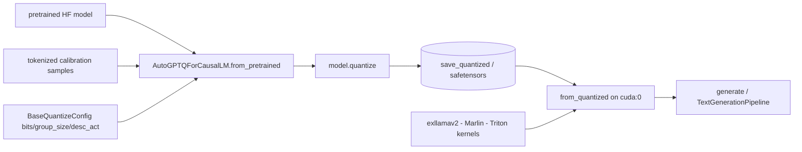

# AutoGPTQ/AutoGPTQ

> **Python package for weight-only LLM quantization with GPTQ, now unmaintained.**

## The problem

Keeping an LLM in fp16 eats VRAM: the README's own table shows `gpt-j 6b` going OOM on a
1xRTX3060-12G in fp16 while running at 29.55 tokens/s in gptq-int4. Doing GPTQ yourself
otherwise means wiring calibration code and mixed-precision kernels by hand.

## What it actually does

It exposes `AutoGPTQForCausalLM` and `BaseQuantizeConfig`. You load an unquantized model
(loaded into CPU memory by default), call `model.quantize(examples)` with tokenized
calibration samples, then `save_quantized()` — optionally `use_safetensors=True` — and
`push_to_hub()`. Reloading goes through `from_quantized(..., device="cuda:0")`, after which
`model.generate` or a `TextGenerationPipeline` works as usual. The quantize config carries
`bits`, `group_size` and `desc_act`. Per the FAQ, the default matmul kernel is exllamav2
int4*fp16, and `use_marlin=True` switches to the Marlin kernel. `auto_gptq.eval_tasks` ships
`LanguageModelingTask`, `SequenceClassificationTask` and `TextSummarizationTask` to compare a
model before and after quantization. New architectures are added by subclassing
`BaseGPTQForCausalLM` with `layers_block_name`, `outside_layer_modules` and
`inside_layer_modules`.

## How it is wired



No code-derived diagram exists for this repo; the nodes come from the README's Quick Tour.
Files the README points at: `examples/benchmark/generation_speed.py`,
`examples/quantization/quant_with_alpaca.py`, `docs/tutorial`, `docs/INSTALLATION.md`.

## Trying it

```bash
pip install auto-gptq --no-build-isolation
```

```bash
git clone https://github.com/PanQiWei/AutoGPTQ.git && cd AutoGPTQ
pip install -vvv --no-build-isolation -e .
```

```
pytest tests/ -s
```

README variants: CUDA 11.8 and ROCm 5.7 add
`--extra-index-url https://huggingface.github.io/autogptq-index/whl/cu118/` (resp. `rocm573/`);
the Triton backend is `pip install auto-gptq[triton] --no-build-isolation`; on Intel Gaudi 2,
`BUILD_CUDA_EXT=0 pip install -vvv --no-build-isolation -e .`.

## Cost and gotchas

Free, but a GPU is assumed. Linux and Windows only; Maxwell or older NVIDIA GPUs are not
supported; Marlin needs compute capability 8.0 or 8.6 (Ampere). Wheels are built against
PyTorch 2.2.1 for the matching CUDA/ROCm variant, so a version mismatch means compiling.
`BUILD_CUDA_EXT=0` skips the extension but falls back to a slow Python implementation.
Triton is Linux-only and has no 3-bit quantization. ROCm builds need `rocsparse-dev`,
`hipsparse-dev`, `rocthrust-dev`, `rocblas-dev` and `hipblas-dev`. Pushing to the Hub needs
`huggingface-cli login` or an explicit token. The README warns that quantizing with a single
sample gives poor quality.

## What it is not

It is not a live project: the first line of the README states AutoGPTQ is unmaintained and
points to ModelCloud/GPTQModel for bug fixes and new model support. It is not an inference
server or an API — it is a library you call from your own Python code. It is not universal
either: the supported-models table stops at bloom, gpt2, gpt_neox, gptj, llama, moss, opt,
gpt_bigcode, codegen and falcon, so nothing released since. And quantization is not free in
quality — the README notes `desc_act=False` speeds up inference but may hurt perplexity.

## Alternatives

- **ModelCloud/GPTQModel** — named in the README as the successor; the default today if you
  want maintained GPTQ.
- **qwopqwop200/GPTQ-for-LLaMa** — credited as the origin of the quantization code; lower
  level, without the `AutoGPTQForCausalLM` APIs.
- **pytorch/ao** (catalogue neighbour) — if you want quantization inside the PyTorch stack
  rather than a GPTQ-specific package.

## Why it matters to you

Worth knowing so you can read existing GPTQ checkpoints and understand the arguments
(`bits`, `group_size`, `desc_act`, `use_marlin`) that surface in transformers, optimum and
peft, where `auto-gptq` was integrated. For new quantization work the README itself points
elsewhere, so there is no reason to start here.
