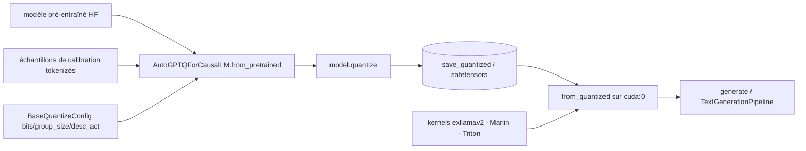

# AutoGPTQ/AutoGPTQ

> **Paquet Python de quantification de LLM en poids seuls (GPTQ), aujourd'hui non maintenu.**

## Le problème

Faire tenir un LLM en fp16 sur un GPU coûte de la VRAM : le README montre `gpt-j 6b` en OOM
sur un RTX3060-12G en fp16, alors qu'il tourne en gptq-int4. Quantifier soi-même un modèle
avec l'algorithme GPTQ demande sinon d'assembler kernels et code de calibration à la main.

## Ce que ça fait vraiment

Expose `AutoGPTQForCausalLM` et `BaseQuantizeConfig` : on charge un modèle non quantifié,
on appelle `model.quantize(examples)` avec des échantillons de calibration, puis
`save_quantized()` (avec option `use_safetensors=True`) et `push_to_hub()`. Le rechargement
passe par `from_quantized(..., device="cuda:0")`. La config porte `bits`, `group_size`,
`desc_act`. Le README dit que le kernel par défaut est exllamav2 int4*fp16, et que
`use_marlin=True` bascule sur le kernel Marlin. Un module `auto_gptq.eval_tasks` fournit
`LanguageModelingTask`, `SequenceClassificationTask` et `TextSummarizationTask`. On étend le
support d'une architecture en sous-classant `BaseGPTQForCausalLM` (`layers_block_name`,
`outside_layer_modules`, `inside_layer_modules`).

## Comment c'est branché



Aucun diagramme tiré du code n'existe pour ce dépôt : ces nœuds viennent des appels du
« Quick Tour » du README. Fichiers cités par le README :
`examples/benchmark/generation_speed.py`, `examples/quantization/quant_with_alpaca.py`,
`docs/tutorial`, `docs/INSTALLATION.md`.

## Essayer

```bash
pip install auto-gptq --no-build-isolation
```

```bash
git clone https://github.com/PanQiWei/AutoGPTQ.git && cd AutoGPTQ
pip install -vvv --no-build-isolation -e .
```

```
pytest tests/ -s
```

Variantes du README : CUDA 11.8 et ROCm 5.7 passent par
`--extra-index-url https://huggingface.github.io/autogptq-index/whl/cu118/` (resp. `rocm573/`) ;
le backend Triton par `pip install auto-gptq[triton] --no-build-isolation` ;
sur Gaudi 2, `BUILD_CUDA_EXT=0 pip install -vvv --no-build-isolation -e .`.

## Coût et pièges

Gratuit, mais il faut un GPU : Linux ou Windows uniquement, pas de Maxwell ou antérieur côté
NVIDIA, et Marlin n'est disponible que sur compute capability 8.0/8.6 (Ampere). La roue est
construite contre PyTorch 2.2.1 selon la variante CUDA/ROCm — un décalage de version se paie
en compilation. `BUILD_CUDA_EXT=0` désactive l'extension mais fait retomber sur une
implémentation Python lente. Triton ne couvre que Linux et pas la quantification 3 bits.
ROCm exige `rocsparse-dev`, `hipsparse-dev`, `rocthrust-dev`, `rocblas-dev`, `hipblas-dev`.
Pousser sur le Hub demande `huggingface-cli login` ou un token explicite. Le README avertit
lui-même que quantifier avec un seul échantillon donne une qualité douteuse.

## Ce que ce n'est pas

Ce n'est pas un projet vivant : la première ligne du README annonce que AutoGPTQ n'est plus
maintenu et renvoie vers ModelCloud/GPTQModel pour les correctifs et les nouveaux modèles.
Ce n'est pas un serveur d'inférence ni une API : c'est une bibliothèque qu'on appelle depuis
son propre code Python. Ce n'est pas universel non plus — la table des modèles supportés
s'arrête à bloom, gpt2, gpt_neox, gptj, llama, moss, opt, gpt_bigcode, codegen, falcon, donc
rien des architectures parues depuis. Et la quantification n'est pas gratuite en qualité :
`desc_act=False` accélère l'inférence mais dégrade la perplexité, dit le README.

## Alternatives

- **ModelCloud/GPTQModel** — nommé par le README comme le successeur ; c'est le choix par
  défaut aujourd'hui si on veut du GPTQ maintenu.
- **qwopqwop200/GPTQ-for-LLaMa** — cité comme la source du code de quantification ; plus bas
  niveau, sans les APIs `AutoGPTQForCausalLM`.
- **pytorch/ao** (voisin du catalogue) — si l'on cherche de la quantification côté PyTorch
  plutôt qu'un paquet dédié à GPTQ.

## Pour toi

À connaître pour lire les modèles GPTQ existants et comprendre les arguments (`bits`,
`group_size`, `desc_act`, `use_marlin`) qu'on retrouve dans transformers et optimum, où
`auto-gptq` a été intégré. Pour un nouveau travail de quantification, le README lui-même
pointe ailleurs : pas de raison de démarrer ici.
