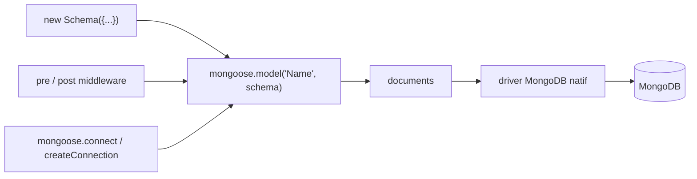

# Automattic/mongoose

> Modélisation d'objets MongoDB pour Node.js : schémas, validation, middleware.

## Le problème
Le driver MongoDB natif ne valide rien : chaque document peut avoir n'importe quelle forme.
Sans couche de schéma, les règles métier se dispersent dans tout le code applicatif.

## Ce que ça fait vraiment
Un `Schema` définit types, valideurs (synchrones et asynchrones), valeurs par défaut, getters/setters, index, méthodes et statiques.
Les middlewares `pre`/`post` interceptent les opérations et peuvent muter les arguments passés aux suivants.
Les documents imbriqués héritent de toutes ces fonctions ; les pseudo-jointures sont gérées par le schéma.
Les commandes sont tamponnées jusqu'à la connexion : on peut déclarer modèles et requêtes avant que la base réponde.

## Comment c'est branché


## Essayer
```sh
npm install mongoose
pnpm add mongoose
yarn add mongoose
bun add mongoose
deno run --allow-net --allow-read --allow-sys --allow-env mongoose-test.js
```

## Coût et pièges
Gratuit, mais il faut Node.js et une instance MongoDB ; le support Deno est en alpha.
Mongoose 9.0.0 (21 novembre 2025) introduit des ruptures documentées hors README.

## Ce que ce n'est pas
Ce n'est pas un contournement du driver : passer par `YourModel.collection` court-circuite hooks et validation.
Ce n'est pas indifférent à la connexion utilisée : un modèle déclaré sur la connexion par défaut ne fonctionne pas sur une connexion créée à part.
Attention au mot `type` dans un schéma : imbriqué sans notation objet, il est interprété comme le type du champ.

## Alternatives
Mongoose Studio : GUI navigateur de l'équipe, pour explorer et éditer sans exporter les données.
Tidelift : offre commerciale de support et maintenance sur les dépendances, dont Mongoose.

## Pour toi
Aucun rapport avec ton profil data/IA : à ignorer sauf backend Node à maintenir.
