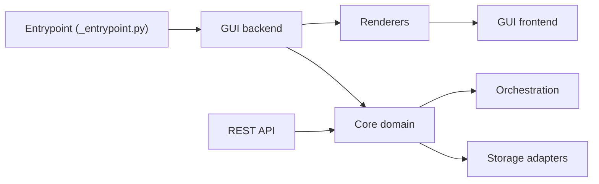

# Avaiga/taipy

> Bibliothèque Python pour construire des applications web data et IA avec orchestration de scénarios.

## Le problème
Passer d'un notebook à une application web utilisable demande du frontend, de l'orchestration de pipelines et de la gestion d'état que les data scientists ne veulent pas écrire.

## Ce que ça fait vraiment
`taipy-gui` génère une interface depuis du Python (Markdown ou builder), rendue par des composants React et synchronisée par websocket.
`taipy-core` modélise scénarios, tâches, jobs et data nodes, avec orchestrateur, versionnage et migrations.
Data nodes vers fichiers, SQL, MongoDB, S3, Parquet ; événements pub/sub ; API REST séparée.
Templates de projets ; Taipy Designer et Studio forment l'écosystème autour.

## Comment c'est branché


## Essayer
```bash
pip install taipy
```

## Coût et pièges
Bibliothèque gratuite ; Taipy Designer fait partie d'un écosystème dont le README ne précise pas la licence. Télémétrie citée parmi les outils d'exploitation.

## Ce que ce n'est pas
Pas un simple outil de dashboard : il impose son modèle de scénarios et data nodes. Le README reste très promotionnel et peu technique.

## Alternatives
Aucune alternative nommée dans le README.

## Pour toi
À surveiller : intéressant quand une démo doit gérer des scénarios what-if et des pipelines, mais plus lourd à apprendre qu'un outil de dashboard classique.
