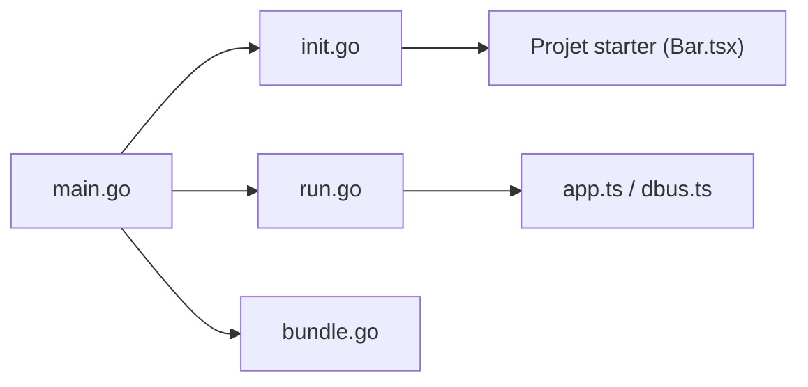

# Aylur/ags

> Outil d'amorçage de projets de shell de bureau Linux basés sur Astal et Gnim.

## Le problème
Écrire un shell de bureau (barre, widgets) sur GTK demande de monter un projet GJS, JSX et bundling.

## Ce que ça fait vraiment
Le README est très court : AGS est un outil CLI d'échafaudage pour Astal (bibliothèques Vala/C) et Gnim (JSX pour GJS). L'architecture montre des commandes d'initialisation, d'exécution, de bundling et d'inspection d'instances, des modèles GTK3 et GTK4, et un runtime avec service D-Bus.

## Comment c'est branché

## Essayer
Aucune commande documentée dans le README (renvoi au wiki).

## Coût et pièges
Gratuit. Documentation hors dépôt (wiki).

## Ce que ce n'est pas
Pas un shell prêt à l'emploi : il génère le squelette.

## Alternatives
Aucune citée dans le README.

## Pour toi
Personnalisation de bureau Linux, sans rapport avec data/IA : ignorer.

