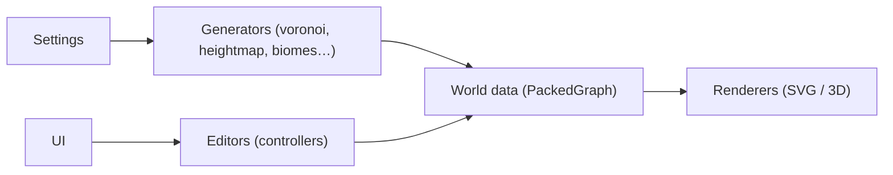

# Azgaar/Fantasy-Map-Generator

> Application web gratuite de génération et d'édition de cartes de fantasy pour auteurs et maîtres de jeu.

## Le problème
Dessiner à la main des cartes cohérentes (reliefs, rivières, États, villes) pour un monde imaginaire prend des heures.

## Ce que ça fait vraiment
Génère procéduralement un graphe de Voronoi, un relief, des biomes, des rivières, des villes, des États, des routes et des biens. Un éditeur permet d'ajuster le résultat ; rendu SVG, option 3D. Sauvegarde locale (IndexedDB), fichiers `.map`, application de bureau et build Nix. Migration en cours de JavaScript vers TypeScript.

## Comment c'est branché


## Essayer
```bash
nix run github:Azgaar/Fantasy-Map-Generator
```
Sinon, utiliser directement l'application en ligne.

## Coût et pièges
Gratuit ; soutien via Patreon. L'auteur qualifie le code de « brouillon ». Licence présente mais non identifiée par GitHub.

## Ce que ce n'est pas
Pas un moteur de jeu ni un outil de SIG réel.

## Alternatives
Aucune nommée dans le README.

## Pour toi
À ignorer : outil créatif sans lien avec ton métier, sauf usage de loisir ou pour génération procédurale à étudier.

