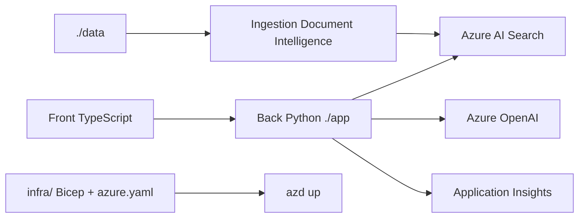

# Azure-Samples/azure-search-openai-demo

> Application RAG de référence : chat sur tes documents avec Azure OpenAI et Azure AI Search.

## Le problème
Monter un RAG d'entreprise demande d'assembler ingestion documentaire, index vectoriel, modèle,
citations, authentification et traçage — chacun avec ses pièges de configuration.

## Ce que ça fait vraiment
Déploie d'un bout à l'autre une interface de chat multi-tours sur tes propres documents : back
Python, front TypeScript, infra Bicep, le tout provisionné par `azd up` sur Azure Container Apps.
Affiche citations et cheminement de raisonnement pour chaque réponse, et expose les réglages
directement dans l'UI pour expérimenter. Options : modèles multimodaux pour documents riches en
images, entrée/sortie vocale, connexion et contrôle d'accès par Microsoft Entra, traçage
Application Insights. Des variantes JavaScript, .NET et Java existent.

## Comment c'est branché


## Essayer
```bash
azd init -t azure-search-openai-demo
azd auth login
azd env new
azd up
azd deploy
./app/start.sh
azd down
```

## Coût et pièges
Facture Azure immédiate et réelle : Container Apps, Container Registry, Azure OpenAI au token,
Document Intelligence à la page, AI Search à l'heure, Blob Storage, éventuellement Cosmos DB,
AI Vision et Monitor. Le README prévient que des coûts courent même si on interrompt `azd up`
en route, et insiste sur `azd down`. Compte Azure avec droits `roleAssignments/write` requis.
Python 3.10–3.14, Node 20+, PowerShell 7+ sous Windows.

## Ce que ce n'est pas
Un avertissement de sécurité explicite : ce code est une démonstration, **à ne pas mettre en
production** sans durcissement. Ce n'est pas supporté par Microsoft Support, seulement par les
mainteneurs via les issues. Les PDF d'exemple sont générés par un modèle, sans valeur factuelle.

## Alternatives
- **Variantes JavaScript, .NET, Java** : mêmes fonctions, autre pile.
- **Alternative RAG chat samples** : page de comparaison citée dans la doc du dépôt.

## Pour toi
Excellente référence de lecture pour l'architecture RAG ; coûteuse et verrouillée Azure à l'usage.
