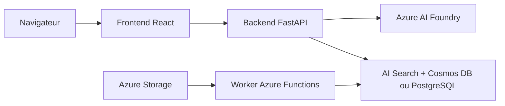

# Azure-Samples/chat-with-your-data-solution-accelerator

> Modèle de déploiement Azure d'un chat RAG avec citations sur tes propres documents.

## Le problème
Ouvrir la connaissance enfouie dans contrats, politiques et manuels sans tout chercher à la main.

## Ce que ça fait vraiment
Déploie par `azd up` dans ta souscription Azure : front React, API FastAPI et worker d'ingestion Azure Functions sur Container Apps. Réponses ancrées avec citations, recherche via Azure AI Search + Cosmos DB ou PostgreSQL + pgvector (au choix au déploiement), orchestrateur Agent Framework ou LangGraph, Content Safety, voix, Entra ID en option. Identité managée, sans Key Vault.

## Comment c'est branché


## Essayer
```bash
azd up
azd down
```
Le README renvoie au guide de déploiement pour le détail.

## Coût et pièges
Abonnement Azure avec rôles Contributor et RBAC ; quota Azure OpenAI à vérifier avant ; les ressources facturent tant que tu n'as pas fait `azd down`. Coût imprévisible selon région et usage.

## Ce que ce n'est pas
« Un point de départ, pas un système de production clé en main » (le README). Aucune garantie de qualité de retrieval sur tes données.

## Alternatives
Le README cite d'autres accélérateurs Microsoft : document knowledge mining, conversation knowledge mining, content processing.

## Pour toi
À surveiller : bon squelette si tu es déjà sur Azure, inutile hors de cet écosystème.
