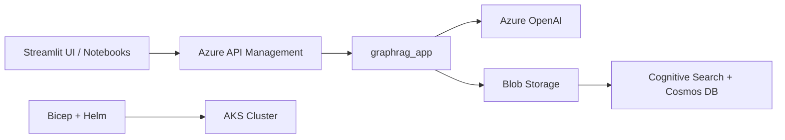

# Azure-Samples/graphrag-accelerator

> Démonstration Microsoft qui déploie la bibliothèque graphrag en API hébergée sur Azure, désormais abandonnée.

## Le problème
Indexer un corpus en graphe de connaissances et l'interroger demande d'assembler soi-même plusieurs services cloud et un pipeline d'indexation.

## Ce que ça fait vraiment
Enveloppe le paquet Python `graphrag` dans une API (`graphrag_app`) déployée sur AKS derrière Azure API Management. Des jobs Kubernetes indexent les données stockées en Blob vers Cosmos DB et Cognitive Search, avec Azure OpenAI pour les LLM. Un frontend Streamlit et deux notebooks servent de démonstration. Le déploiement passe par des modules Bicep et un chart Helm.

## Comment c'est branché


## Essayer
Le README ne donne aucune commande : il renvoie à un guide de déploiement et à un notebook Quickstart.
```bash
# aucune commande documentée dans le README
```

## Coût et pièges
Le README avertit que les services Azure peuvent coûter « substantiellement » et que l'indexation est chère : commencer avec peu de données. Compte Azure et déploiement complet requis.

## Ce que ce n'est pas
Pas maintenu (dépôt archivé, dernier push 2025-05-27) et pas une offre Microsoft officiellement supportée. Ce n'est pas la bibliothèque graphrag elle-même.

## Alternatives
- graphrag (la bibliothèque) : le README y renvoie pour les évolutions futures.

## Pour toi
Ignorer : archivé et lié à un déploiement Azure coûteux ; suis plutôt la bibliothèque graphrag si le GraphRAG t'intéresse.
