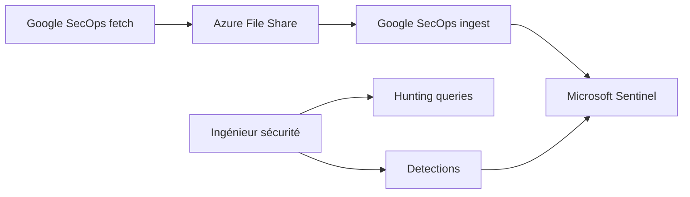

# Azure/Azure-Sentinel

> Dépôt officiel de contenu de sécurité pour Microsoft Sentinel et Microsoft 365 Defender.

## Le problème
Une équipe SOC qui adopte Sentinel doit écrire elle-même détections, requêtes de chasse, classeurs et playbooks avant d'être opérationnelle.

## Ce que ça fait vraiment
Collection de détections, requêtes d'exploration et de chasse (KQL), workbooks et playbooks, plus des connecteurs d'ingestion (Google SecOps, Infoblox, Netskope) qui passent par un Azure File Share avant Sentinel. Les contributions sont validées par des tests de structure YAML et de syntaxe KQL en CI, rejouables en local avec `dotnet test`.

## Comment c'est branché


## Essayer
```bash
cd Azure-Sentinel\\.script\tests\KqlvalidationsTests\
dotnet test
```

## Coût et pièges
Le contenu est MIT, mais il n'a de valeur que dans un abonnement Microsoft Sentinel (facturé, non chiffré dans le README). La validation locale demande le SDK .NET Core 3.1.

## Ce que ce n'est pas
Pas une application ni un produit unique : un dépôt de contenu communautaire sans runtime intégré. Le README décrit surtout le processus de contribution.

## Alternatives
Aucune alternative nommée dans le README.

## Pour toi
Ignorer : sauf si tu fais de la détection de menaces sur Sentinel, ce catalogue KQL n'a pas d'usage en data/IA/MLOps.

