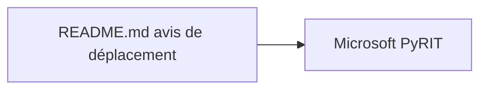

# Azure/PyRIT

> Dépôt archivé d'un framework d'évaluation des risques de l'IA générative, désormais déplacé chez Microsoft.

## Le problème
Repérer de façon systématique les risques d'un système d'IA générative avant sa mise en service.

## Ce que ça fait vraiment
Ce dépôt ne contient plus que l'avis de déménagement : le README renvoie vers https://github.com/microsoft/PyRIT. Aucun code d'exécution n'y figure, le fonctionnement n'est donc pas vérifiable ici. README très court : fiche minimale.

## Comment c'est branché

## Essayer
Aucune commande documentée. Le README ne propose que le lien vers le nouveau dépôt.

## Coût et pièges
Rien à installer ici. Dépôt archivé (dernier push le 2026-03-25) : aucune correction ni évolution ne viendra de cet emplacement.

## Ce que ce n'est pas
Ce n'est pas le projet actif : c'est une coquille de redirection. Ce n'est pas non plus une source pour évaluer l'outil, faute de code.

## Alternatives
microsoft/PyRIT, cité dans le README comme nouvelle adresse du projet.

## Pour toi
À ignorer : dépôt archivé et vide de code ; si l'évaluation de risques d'IA générative t'intéresse, va directement voir microsoft/PyRIT.
